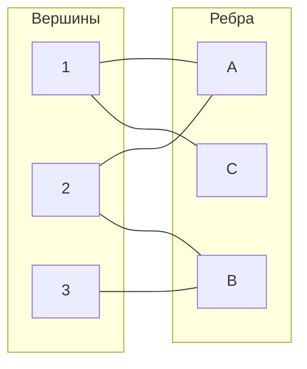

# Дискретный анализ. Семинары. 4 семестр.

**Семинары читал:** Георгий Соколов
**Конспектировал:** Сергей Малышев
[Github](https://github.com/SeBorgey/discran2-sems)

---

**Содержание**

1.  [Числа Рамсея и связанные результаты](#семинар-1-числа-рамсея-и-связанные-результаты)
2.  [Доказательство теоремы Ширера](#семинар-2-доказательство-теоремы-ширера)
3.  [Числа Рамсея для подграфов](#семинар-3-числа-рамсея-для-подграфов)
4.  [Существование чисел Рамсея для гиперграфов. Независимость.](#семинар-4-существование-чисел-рамсея-для-гиперграфов)
5.  [ЛЛЛ](#семинар-5-ллл)
6.  [Применение ЛЛЛ](#семинар-6-применение-ллл)
7.  [Доказательство нижней оценки для числа Рамсея R(n,4)](#семинар-7-доказательство-нижней-оценки-для-числа-рамсея-rn4)
8.  [Двудольные графы, Мультигиперграфы и Матрицы](#семинар-8-двудольные-графы-мультигиперграфы-и-матрицы)
9. [Лемма Холла и теорема Кёнига](#семинар-9-лемма-холла-и-теорема-кёнига)
10. [Системы Общих Представителей (СОП)](#семинар-10-системы-общих-представителей-соп)
11. [VC-размерность](#семинар-11-vc-размерность)
12. [Комбинаторная теорема о нулях](#семинар-12-комбинаторная-теорема-о-нулях)
13. [Оценка m(n,3,1). AKS](#семинар-13-оценка-mn31-aks)

---

## Семинар 1: Числа Рамсея и связанные результаты

### **Напоминание: Теорема Турана**
**Формулировка через количество рёбер и число независимости**:  
   Для графа с \( n \) вершинами, \( e \) рёбрами и числом независимости \( \alpha \) (размер максимального независимого множества) выполняется:  
   \[
   e \geq \frac{n \left( \frac{n}{\alpha} - 1 \right)}{2}.
   \]
   Эквивалентная запись через среднюю степень \( t = \frac{2e}{n} \):  
   \[
   \alpha \geq \frac{n}{t + 1}.
   \]

### **Напоминание: Слабая гипотеза Бержа**  
Граф является совершенным тогда и только тогда, когда его дополнение также совершенно.

### **Числа Рамсея**  
**Определение**:  
\( R(n, m) = \min \{ K | \) любой граф на  K вершинах содержит клику размера n или независимое множество размера  m \(\} \).  

R(n,m) = k означает:
1. В любом графе на k вершинах есть клика размера n или независимое множество размера m
2. Существует граф на k-1 вершинах без клик размера n и независимых множеств размера m

### **Существование чисел Рамсея**  
 **Цель**: Показать, что для достаточно большого \( k \), любой граф на \( k \) вершинах содержит клику размера \( n \) **или** независимое множество размера \( m \). Это докажет существование числа Рамсея \( R(n, m) \leq k \).

1. Если граф на \( k \) вершинах **не содержит** независимого множества размера \( m \), то по теореме Турана:  
   \[
   e \geq \frac{k \left( \frac{k}{m-1} - 1 \right)}{2} \sim \frac{k^2}{2(m-1)}.
   \]
2. Если граф **не содержит** клики размера \( n \), то в его дополнении нет независимого множества размера \( n \). Количество не-рёбер:  
   \[
   C_{k}^{2} - e \geq \frac{k \left( \frac{k}{n-1} - 1 \right)}{2} \sim \frac{k^2}{2(n-1)}.
   \]
3. \( C_{k}^{2} \approx \frac{k^2}{2} \) следовательно
$$\frac{k²}{2} - e \geq  \frac{k²}{2(n-1)}$$

4. Складывая неравенства 1 и 3:  
   \[
   \frac{k^2}{2} \geq \frac{k^2}{2(m-1)} + \frac{k^2}{2(n-1)}.
   \]  
   Сокращая на \( \frac{k^2}{2} \), получаем:  
   \[
   1 \geq \frac{1}{m-1} + \frac{1}{n-1}.
   \]

5. Противоречия **нет**. Например, для \( n = m = 3 \):  
   \[
   \frac{1}{2} + \frac{1}{2} = 1 \leq 1.
   \]  
   Это означает, что теорема Турана **не даёт противоречия** для таких \( n, m \). Следовательно, она слишком слаба, чтобы доказать существование чисел Рамсея в общем случае.

Рассмотрим свойства. В процессе станет понятно существование.

**Свойства чисел Рамсея**:  
1. \( R(n, m) = R(m, n) \) (дополнение).  
2. \( R(n, 1) = 1 \), (есть клика размера 1)
3. \( R(n, 2) = n \). (либо все врешины связаны, либо одна пара нет)
4. \( R(3, 3) = 6 \).  

### **Доказательство \( R(3, 3) = 6 \)**  
1. Рассмотрим произвольную раскраску рёбер \( K_6 \) в два цвета (например, красный и синий).  
2. Выберем вершину \( v \). Из неё выходит 5 рёбер. По принципу Дирихле, хотя бы 3 из них одного цвета (скажем, красного).  
3. Пусть эти рёбра ведут к вершинам \( a, b, c \).  
   - Если среди \( a, b, c \) есть красное ребро, например, \( (a, b) \), то треугольник \( v-a-b \) красный.  
   - Если все рёбра между \( a, b, c \) синие, то треугольник \( a-b-c \) синий.  
4. Таким образом, в любом случае существует одноцветный треугольник. Для \( K_5 \) существует контрпример  (цикл), поэтому \( R(3, 3) = 6 \).

**Теорема**:  
\[
R(n, m) \leq R(n-1, m) + R(n, m-1).
\]  
**Доказательство**:  
1. Рассмотрим граф на \( k = R(n-1, m) + R(n, m-1) \) вершинах.  
2. Выберем произвольную вершину \( v \).  
   - В её окрестности (рёбра одного цвета) не менее \( R(n-1, m) \) вершин.  
   - Вне окрестности (рёбра другого цвета) не менее \( R(n, m-1) \) вершин.  
3. Если в окрестности есть клика размера \( n-1 \), то вместе с \( v \) она образует клику размера \( n \).  
4. Если вне окрестности есть независимое множество размера \( m-1 \), то вместе с \( v \) оно образует независимое множество размера \( m \).  

**Следствие**:  
\[
R(n, m) \leq C_{n + m - 2}^{n - 1}.
\]  

### **Оценки чисел Рамсея**  
1. **Для \( R(n, 3) \)**:
   - Верхняя оценка:  
     \[
     R(n, 3) \leq (1 + o(1)) \frac{n^2}{\ln n}.
     \]
   - Нижняя оценка:  
     \[
     R(n, 3) \geq \left( \frac{1}{4} + o(1) \right) \frac{n^2}{\ln n}.
     \]

2. **Для \( R(n, n) \)**:
   - Верхняя оценка:  
     \[
     R(n,n) ≤ C^{n-1}_{n-2} · const · \frac{4^n}{\sqrt n}
     \]
     \[
     R(n, n) \leq (4 - \varepsilon)^n, \quad \varepsilon \approx \frac{1}{100}.
     \]
   - Нижняя оценка:  
     \[
     R(n, n) \geq \text{poly}(n) \cdot 2^{\frac{n}{2}}.
     \]

**Методы доказательства**:  
- **Вероятностный метод** используется для доказательства существования графов с определёнными свойствами (например, отсутствие клик и больших независимых множеств).  

### **Теорема Ширера (частный случай теоремы Турана)**  
Для графов **без треугольников** со средней степенью вершины \( t \):  
\[
\alpha \geq n \cdot f(t), \quad \text{где } f(t) \sim \frac{\ln t}{t}.
\]  
**Применение**:  
Эта теорема используется для доказательства верхней оценки \( R(t, 3) \leq (1 + o(1)) \frac{t^2}{\ln t} \).

---
## Семинар 2: Доказательство теоремы Ширера

**Доказательство**  
\( f(t) \) — убывающая выпуклая функция (\( f' < 0 \), \( f'' > 0 \)).
Проведем индукцию по числу вершин \( n \).

**База индукции**  
Для малых \( n \) утверждение проверяется непосредственно. Например, при \( n = 1 \): \( \alpha(G) = 1 \geq 1 \cdot f(t) \), где \( t = 0 \), и \( f(0) \leq 1 \).

**Индукционный переход**  
Пусть утверждение верно для всех графов с числом вершин меньше \( n \). Рассмотрим произвольную вершину \( v \) в графе \( G \). Введем обозначения:
- \( y(v) = \text{число соседей } v \),
- \( z(v) = \sum_{u \sim v} \deg(u) \) (сумма степеней соседей \( v \)).

**1. Уменьшение графа**  
Добавим \( v \) в независимое множество. Тогда:
- Удаляются \( v \) и все её соседи, поэтому новый граф \( G' \) содержит \( n' = n - (y(v) + 1) \) вершин.
- Число рёбер \( l' = l - z(v) \).  
*Пояснение*: Так как в \( G \) нет треугольников, соседи \( v \) не соединены между собой. Удаление \( v \) и её \( y(v) \) соседей убирает ровно \( z(v) \) рёбер (каждое ребро, инцидентное соседу \( v \), учитывается один раз).

**2. Новая средняя степень**  
Средняя степень \( t' \) в \( G' \):  
\[
t' = \frac{2l'}{n'} = \frac{2(l - z(v))}{n - y(v) - 1} = \frac{tn - 2z(v)}{n - y(v) - 1},
\]  
где \( l = \frac{tn}{2} \) (по определению средней степени).

**3. Применение индукционного предположения**  
По индукции для \( G' \):  
\[
\alpha(G') \geq n' \cdot f(t').
\]  
Следовательно, для исходного графа:  
\[
\alpha(G) \geq 1 + \alpha(G') \geq 1 + n' \cdot f(t'),
\]  
где \( 1 \) соответствует вершине \( v \).

**4. Выбор вершины \( v \)**  
Чтобы усреднить оценку, выберем \( v \) случайно (равновероятно среди всех вершин). Тогда:  
\[
\mathbb{E}[\alpha(G)] \geq \mathbb{E}\left[1 + n' \cdot f(t')\right] = 1 + \mathbb{E}[n' \cdot f(t')].
\]  
Нам нужно доказать:  
\[
1 + \mathbb{E}[n' \cdot f(t')] \geq n \cdot f(t).
\]

**5. Использование выпуклости \( f \)**  
Так как \( f \) выпукла, для любого \( t' \):  
\[
f(t') \geq f(t) + (t' - t) \cdot f'(t).
\]  
Подставим это в оценку:  
\[
\mathbb{E}[n' \cdot f(t')] \geq \mathbb{E}\left[n' \cdot \left(f(t) + (t' - t) \cdot f'(t)\right)\right] = \mathbb{E}[n' \cdot f(t)] + \mathbb{E}[n' \cdot (t' - t) \cdot f'(t)].
\]  
Раскроем слагаемые:
1. \( \mathbb{E}[n' \cdot f(t)] = f(t) \cdot \mathbb{E}[n'] = f(t) \cdot \left(n - \mathbb{E}[y(v) + 1]\right) \),
2. \( \mathbb{E}[n' \cdot (t' - t) \cdot f'(t)] = f'(t) \cdot \mathbb{E}\left[n' \cdot t' - n' \cdot t\right] \).

**6. Вычисление математических ожиданий**  
Вычислим ключевые величины:
- \( \mathbb{E}[y(v)] = \frac{1}{n} \sum_{v} y(v) = \frac{2l}{n} = t \) (средняя степень),
- \( \mathbb{E}[z(v)] = \frac{1}{n} \sum_{v} z(v) = \frac{1}{n} \sum_{v} \sum_{u \sim v} \deg(u) = \frac{1}{n} \sum_{u} \deg(u)^2 \geq \frac{(\sum \deg(u))^2}{n^2} = t^2 \) (неравенство Коши-Шварца).

**7. Подстановка в неравенство**  
После подстановки получаем:  
\[
1 + f(t) \cdot (n - t - 1) + f'(t) \cdot \left(tn - 2\mathbb{E}[z(v)] - t(n - t - 1)\right).
\]  
Упростим выражение в \( f'(t) \):  
\[
tn - 2\mathbb{E}[z(v)] - tn + t^2 + t = t^2 + t - 2\mathbb{E}[z(v)] \leq t^2 + t - 2t^2 = -t^2 + t.
\]  
Итоговая оценка:  
\[
\alpha(G) \geq 1 + (n - t - 1)f(t) + (-t^2 + t)f'(t).
\]  
Требуется, чтобы:  
\[
1 - (t + 1)f(t) + (t - t^2)f'(t) \geq 0 \quad \forall t.
\]  
Это приводит к дифференциальному уравнению:  
\[
(t - t^2)f'(t) - (t + 1)f(t) + 1 = 0.
\]  
Его решение (оставленное на следующее занятие) определяет явный вид \( f(t) \), гарантирующий выполнение неравенства \( \alpha(G) \geq n \cdot f(t) \).

**Итог**  
Индукционный переход доказан. Выпуклая функция \( f(t) \), удовлетворяющая уравнению, обеспечивает требуемую оценку независимого множества. Отсутствие треугольников критично для корректности шага 1 (удаление \( z(v) \) рёбер).

---
## Семинар 3: Числа Рамсея для подграфов

**Число Рамсея $R(G,H)$** определяется как:

$$R(G,H) = \min\{n \mid K_n \text{ нельзя покрасить в 2 цвета так, что нет ни неиндуцированного}$$
$$\text{подграфа } G \text{ первого цвета, ни } H \text{ второго цвета}\}$$

Для полных графов используется упрощенное обозначение:

$$R(n,m) = R(K_n, K_m)$$

Для произвольных графов $G$ и $H$ верно:

$$R(G,H) \leq R(\text{|V(G)|, |V(H)|})$$

где $|V(G)|$ и $|V(H)|$ - количество вершин в графах $G$ и $H$ соответственно.

**Методы оценки**
- Оценка сверху доказывается методом индукции
- Оценка снизу доказывается путём построения явного примера

### **Двудольные числа Рамсея: доказательство существования с использованием принципа Дирихле**

**Определение.**  
Двудольное число Рамсея \( b(n, m) \) — это минимальное \( x \), такое что при любой 2-раскраске рёбер полного двудольного графа \( K_{x,x} \), в нём обязательно найдётся:
- Либо \( K_{n,n} \) первого цвета,
- Либо \( K_{m,m} \) второго цвета.

**Цель доказательства.**  
Показать, что \( b(n, m) \leq 2^{2n-1}(n-1) + 1 \), используя принцип Дирихле.

**Доказательство:**

**1. Построение структуры графа.**  
Рассмотрим двудольный граф \( K_{x,x} \) с долями \( A \) и \( B \), где \( x = 2^{2n-1}(n-1) + 1 \). Раскрасим его рёбра в два цвета (например, красный и синий).

**2. Выбор подмножества в левой доле.**  
Выделим в доле \( A \) подмножество \( L \) размера \( k = 2n - 1 \). Оставшиеся вершины в \( A \) не участвуют в дальнейшем анализе.

**3. Векторы индикаторов для правой доли.**  
Каждой вершине \( v \) из доли \( B \) сопоставим **вектор индикаторов** длины \( k \), где:
- \( i \)-я координата вектора равна \( 1 \), если ребро между \( v \) и \( i \)-й вершиной из \( L \) красное,
- \( 0 \) — если синее.

Всего существует \( 2^k = 2^{2n-1} \) возможных векторов.

**4. Применение принципа Дирихле к правой доле.**  
В доле \( B \) находится \( |B| = x = 2^{2n-1}(n-1) + 1 \) вершин. По принципу Дирихле, если распределить \( x \) вершин по \( 2^{2n-1} \) "ящикам" (типам векторов), то хотя бы один ящик будет содержать не менее \( n \) вершин.  
**Вывод:** Существует подмножество \( S \subseteq B \) размера \( n \), где все вершины имеют одинаковый вектор индикаторов.

**5. Анализ вектора индикаторов.**  
Рассмотрим вектор, общий для всех вершин в \( S \). В левой доле \( L \) (размер \( 2n-1 \)) для этого вектора:
- Либо есть \( n \) вершин, соединённых с \( S \) красными рёбрами,
- Либо есть \( n \) вершин, соединённых с \( S \) синими рёбрами.

Это следует из принципа Дирихле: в \( L \) размером \( 2n-1 \) либо \( \geq n \) единиц, либо \( \geq n \) нулей.

**6. Построение одноцветного \( K_{n,n} \).**  
- Если найдено \( n \) вершин в \( L \) с \( 1 \) в векторе, то вместе с \( S \) они образуют красный \( K_{n,n} \).
- Если найдено \( n \) вершин в \( L \) с \( 0 \), то вместе с \( S \) они образуют синий \( K_{n,n} \).

**7. Завершение доказательства.**  
Таким образом, при \( x = 2^{2n-1}(n-1) + 1 \) в любой 2-раскраске \( K_{x,x} \) обязательно существует одноцветный \( K_{n,n} \). Следовательно, \( b(n, m) \leq 2^{2n-1}(n-1) + 1 \).

---
## Семинар 4: Существование чисел Рамсея для гиперграфов. Независимость

### Рекуррентное соотношение для чисел Рамсея

Докажем следующее рекуррентное соотношение для чисел Рамсея:

$$R_l (n_1, \ldots, n_k) \leq R_l (n_1, R_l (n_2, \ldots, n_k))$$

Это неравенство является обобщением классического рекуррентного соотношения для обычных чисел Рамсея. Для случая $l=2$ и $k=2$ оно принимает вид:

$$R(n,m) \leq R(n, R(n-1,m))$$

Что эквивалентно известному соотношению:

$$R(n,m) \leq 1 + R(n,m-1) + R(n-1,m)$$

#### Доказательство для классического случая

Докажем сначала классическое неравенство:

$$R(n,m) \leq 1 + R(n,m-1) + R(n-1,m) - 1 = R(n,m-1) + R(n-1,m)$$

Рассмотрим произвольный граф $G$ на $R(n,m-1) + R(n-1,m)$ вершинах. Выберем произвольную вершину $v$ и разделим оставшиеся вершины на два множества:
- $A$ - вершины, соединенные с $v$ ребром
- $B$ - вершины, не соединенные с $v$ ребром

По принципу Дирихле, либо $|A| \geq R(n-1,m)$, либо $|B| \geq R(n,m-1)$.

Если $|A| \geq R(n-1,m)$, то в подграфе, индуцированном на $A$, либо есть клика размера $n-1$, либо независимое множество размера $m$. В первом случае, добавив вершину $v$ к клике, получим клику размера $n$ в исходном графе. Во втором случае, имеем независимое множество размера $m$ в исходном графе.

Если $|B| \geq R(n,m-1)$, то в подграфе, индуцированном на $B$, либо есть клика размера $n$, либо независимое множество размера $m-1$. В первом случае, имеем клику размера $n$ в исходном графе. Во втором случае, добавив вершину $v$ к независимому множеству, получим независимое множество размера $m$ в исходном графе.

Таким образом, в графе $G$ всегда найдется либо клика размера $n$, либо независимое множество размера $m$, что и требовалось доказать.

### Обобщение для гиперграфов

Теперь докажем более общее утверждение для $l$-однородных гиперграфов:

$$R_l (n,m) \leq 1 + R_{l-1} (R_l (n-1,m), R_l(n,m-1))$$

#### Доказательство

Рассмотрим произвольный $l$-однородный гиперграф $G$ на $1 + R_{l-1} (R_l (n-1,m), R_l(n,m-1))$ вершинах. Выберем произвольную вершину $v$ и рассмотрим оставшийся подграф $H$ на $R_{l-1} (R_l (n-1,m), R_l(n,m-1))$ вершинах.

Определим $(l-1)$-однородный гиперграф $H'$ на тех же вершинах, что и $H$, следующим образом: множество $X$ из $l-1$ вершин образует ребро в $H'$ тогда и только тогда, когда множество $X \cup \{v\}$ образует ребро в исходном гиперграфе $G$.

Поскольку $|V(H')| = R_{l-1} (R_l (n-1,m), R_l(n,m-1))$, по определению числа Рамсея для $(l-1)$-однородных гиперграфов, в $H'$ найдется либо:

1. Множество $A$ из $R_l (n-1,m)$ вершин, такое что любое подмножество из $l-1$ вершин множества $A$ образует ребро в $H'$.
2. Множество $B$ из $R_l (n,m-1)$ вершин, такое что никакое подмножество из $l-1$ вершин множества $B$ не образует ребро в $H'$.

В первом случае, рассмотрим $l$-однородный гиперграф, индуцированный на множестве $A$. По определению числа $R_l (n-1,m)$, в этом гиперграфе найдется либо:
- Множество из $n-1$ вершин, образующих полный $l$-однородный подграф. Добавив к ним вершину $v$, получим множество из $n$ вершин, образующих полный $l$-однородный подграф в $G$.
- Множество из $m$ вершин, не содержащее ни одного ребра. Это множество также не содержит ребер в $G$.

Во втором случае, рассмотрим $l$-однородный гиперграф, индуцированный на множестве $B$. По определению числа $R_l (n,m-1)$, в этом гиперграфе найдется либо:
- Множество из $n$ вершин, образующих полный $l$-однородный подграф. Это множество также образует полный $l$-однородный подграф в $G$.
- Множество из $m-1$ вершин, не содержащее ни одного ребра. Добавив к ним вершину $v$, получим множество из $m$ вершин, не содержащее ни одного ребра в $G$ (поскольку любое ребро, содержащее $v$, должно содержать $l-1$ вершин из $B$, образующих ребро в $H'$, чего нет по определению $B$).

Таким образом, в гиперграфе $G$ всегда найдется либо полный $l$-однородный подграф на $n$ вершинах, либо множество из $m$ вершин без ребер, что и требовалось доказать.

### Теорема Шура

**Теорема Шура**: Для любой раскраски множества натуральных чисел $\{1, 2, \ldots, N\}$ в $k$ цветов, при достаточно большом $N$, найдутся одноцветные числа $x, y, z$ такие, что $x + y = z$.

#### Историческая справка

Исай Шур доказал эту теорему в 1916 году в контексте исследования уравнения Ферма $x^n + y^n = z^n$. Он пытался показать, что это уравнение имеет решение по любому достаточно большому модулю, что опровергло бы Великую теорему Ферма. Однако, в итоге он доказал, что этим методом теорему Ферма опровергнуть нельзя.

#### Доказательство с использованием чисел Рамсея

Хотя Шур не знал о числах Рамсея (они были введены позже), его теорему можно элегантно доказать с их помощью.

Рассмотрим полный граф на $N = R_2(3, 3, \ldots, 3)$ вершинах, где число троек равно $k$ (количеству цветов в раскраске). Вершины графа пронумеруем числами от $1$ до $N$.

Покрасим ребро $(a, b)$ (где $a > b$) в тот же цвет, что и число $a - b$ в исходной раскраске.

По определению числа Рамсея, в таком графе найдется одноцветный треугольник $(a, b, c)$, где $a > b > c$. Это означает, что числа $a-b$, $b-c$ и $a-c$ имеют один и тот же цвет.

Заметим, что $(a-b) + (b-c) = a-c$. Обозначим $x = a-b$, $y = b-c$ и $z = a-c$. Тогда $x + y = z$, и все три числа имеют один и тот же цвет, что и требовалось доказать.

Таким образом, теорема Шура является прямым следствием существования чисел Рамсея.

### Независимость в теории вероятностей

#### Независимость событий

Два события $A$ и $B$ называются **независимыми**, если:

$$P(A \cap B) = P(A) \cdot P(B)$$

#### Независимость случайных величин

Две случайные величины $\xi$ и $\eta$ называются **независимыми**, если для любых значений $x$ и $y$:

$$P(\xi = x, \eta = y) = P(\xi = x) \cdot P(\eta = y)$$

Это определение можно переформулировать в терминах функций распределения: случайные величины $\xi$ и $\eta$ независимы тогда и только тогда, когда их совместная функция распределения равна произведению их индивидуальных функций распределения:

$$F_{\xi,\eta}(x,y) = F_\xi(x) \cdot F_\eta(y)$$

### Различные типы независимости

#### Попарная независимость

События $A_1, A_2, \ldots, A_n$ называются **попарно независимыми**, если для всех $i \neq j$:

$$P(A_i \cap A_j) = P(A_i) \cdot P(A_j)$$

Случайные величины $\xi_1, \xi_2, \ldots, \xi_n$ называются **попарно независимыми**, если для всех $i \neq j$ случайные величины $\xi_i$ и $\xi_j$ независимы.

#### Независимость в совокупности

События $A_1, A_2, \ldots, A_n$ называются **независимыми в совокупности**, если для любого набора индексов $i_1, i_2, \ldots, i_k$ (где $1 \leq k \leq n$):

$$P(A_{i_1} \cap A_{i_2} \cap \ldots \cap A_{i_k}) = P(A_{i_1}) \cdot P(A_{i_2}) \cdot \ldots \cdot P(A_{i_k})$$

Случайные величины $\xi_1, \xi_2, \ldots, \xi_n$ называются **независимыми в совокупности**, если для любых значений $x_1, x_2, \ldots, x_n$:

$$P(\xi_1 = x_1, \xi_2 = x_2, \ldots, \xi_n = x_n) = P(\xi_1 = x_1) \cdot P(\xi_2 = x_2) \cdot \ldots \cdot P(\xi_n = x_n)$$

#### Важное замечание

Попарная независимость не влечет независимость в совокупности. Существуют примеры, когда случайные величины попарно независимы, но не являются независимыми в совокупности.

### Независимость события от совокупности событий

Событие $A$ называется **независимым от совокупности событий** $B_1, B_2, \ldots, B_n$, если для любого набора индексов $i_1, i_2, \ldots, i_k$ (где $1 \leq k \leq n$):

$$P(A \cap (B_{i_1} \cap B_{i_2} \cap \ldots \cap B_{i_k})) = P(A) \cdot P(B_{i_1} \cap B_{i_2} \cap \ldots \cap B_{i_k})$$

#### Частный случай

Если совокупность состоит из одного события $B$, то независимость события $A$ от совокупности $\{B\}$ сводится к обычному определению независимости событий $A$ и $B$:

$$P(A \cap B) = P(A) \cdot P(B)$$
---
## Семинар 5: ЛЛЛ

### Условие задачи

У нас имеется несколько видов работ, причем каждый вид работ обслуживают 8 специалистов. Каждый вид работ имеет общих специалистов не более чем с 30 другими видами работ.

Требуется: дать каждому специалисту выходной день (либо в субботу, либо в понедельник) таким образом, чтобы в любой из этих дней по любому виду работ оставались доступные специалисты.

### Решение с использованием локальной леммы Ловаса

#### Формулировка локальной леммы Ловаса

Пусть $A_1, \ldots, A_n$ - конечное множество событий.

Предположим, что:
1. $\forall i: P(A_i) \leq p$
2. $\forall i$ существует множество индексов $J_i$ такое, что $|J_i| \leq d$, и событие $A_i$ не зависит от совокупности событий $\{A_j | j \neq i, j \not\in J_i\}$

Если выполняется хотя бы одно из условий:
- $e \cdot p \cdot (d + 1) < 1$
- $4 \cdot p \cdot d < 1$

Тогда $P(\overline{A_1} \cap \cdots \cap \overline{A_n}) > 0$, то есть существует положительная вероятность того, что ни одно из "плохих" событий не произойдет.

#### Применение к нашей задаче

Будем выбирать выходные дни для специалистов случайно и независимо с вероятностью 1/2 для каждого дня (суббота или понедельник).

Определим событие $A_i$ как ситуацию, когда для $i$-го вида работ нет доступных специалистов в какой-то из дней (суббота или понедельник).

**Вычисление вероятности:**
- Вероятность того, что все 8 специалистов конкретного вида работ получат выходной в субботу, равна $(1/2)^8$
- Вероятность того, что все 8 специалистов получат выходной в понедельник, также равна $(1/2)^8$
- Поэтому $P(A_i) = 2 \cdot (1/2)^8 = 2/256 = 1/128 =: p$

**Определение параметра $d$:**
- $d = 30$ (так как каждый вид работ связан не более чем с 30 другими)

**Проверка условия леммы:**
$4 \cdot p \cdot d = 4 \cdot \frac{1}{128} \cdot 30 = \frac{120}{128} < 1$

Условие леммы выполнено, следовательно, существует распределение выходных дней, при котором для каждого вида работ в любой день (суббота или понедельник) будет доступен хотя бы один специалист.

#### Объяснение решения

Идея решения состоит в следующем: если мы случайным образом назначим каждому специалисту выходной день (субботу или понедельник), то с положительной вероятностью получим допустимое расписание.

"Плохие" события $A_i$ соответствуют ситуациям, когда для какого-то вида работ все специалисты отдыхают в один и тот же день. Локальная лемма Ловаса гарантирует существование расписания, при котором ни одно из таких плохих событий не происходит.

Ключевой момент: хотя для одного вида работ вероятность "плохого" события относительно мала ($1/128$), у нас может быть очень много видов работ. Обычного метода вероятностей здесь недостаточно, поскольку при большом количестве событий их объединение может иметь вероятность, близкую к 1. Локальная лемма Ловаса позволяет преодолеть это ограничение, используя структуру зависимостей между событиями.
---
## Семинар 6: Применение ЛЛЛ
### **Разбиение пространства сферами: оценка максимального числа областей**  
**Утверждение**: *m* сфер в трёхмерном пространстве делят его не более чем на *m³* частей.  
**Доказательство** проводится методом математической индукции с опорой на случаи меньших размерностей (*n=1*, *n=2*).  

#### **1. Базовые случаи для меньших размерностей**
##### **Случай *n=1* (окружность)**  
- **Утверждение**: *m* точек на окружности делят её ровно на *m* дуг.  
- **Доказательство**:  
  Каждая новая точка добавляет одну дугу. Для *m* точек получаем *m* непересекающихся дуг.  

##### **Случай *n=2* (сфера)**  
- **Утверждение**: *m* окружностей на сфере делят её не более чем на *1 + 2(1 + 2 + ... + m)* частей.  
- **Доказательство по индукции**:  
  - **База**: Для *m=1* сфера делится на 2 части (внутри и вне окружности).  
  - **Переход**: Пусть для *m−1* окружностей утверждение верно. Добавим *m*-ю окружность.  
    - Каждая предыдущая окружность пересекает новую не более чем в 2 точках → максимум *2(m−1)* точек пересечения.  
    - Эти точки делят *m*-ю окружность на *2(m−1)* дуг.  
    - Каждая дуга добавляет одну новую область на сфере.  
  - **Формула**:  
    \[
    1 + 2(1 + 2 + ... + m) = 1 + 2 \cdot \frac{m(m+1)}{2} = 1 + m(m+1) = m^2 + m + 1 \quad (\leq m^3 \text{ при } m \geq 2).
    \]

#### **2. Трёхмерный случай (*n=3*)**  
**Утверждение**: *m* сфер делят пространство на ≤ *m³* частей.  
**Доказательство по индукции**:  
- **База**: Для *m=1* сфера делит пространство на 2 части (внутри и снаружи).  
- **Переход**: Предположим, что *m−1* сфер создают ≤ *(m−1)³* областей. Добавим *m*-ю сферу.  

##### **Ключевой шаг**: Оценка числа новых областей  
- Новая сфера пересекается с каждой из *m−1* предыдущих сфер по окружности.  
- Эти окружности разбивают поверхность *m*-й сферы на части. Согласно случаю *n=2*, их количество:  
  \[
  1 + (m−1) + (m−1)^2.
  \]  
  - **Пояснение**:  
    - *1* — исходная целая сфера.  
    - *(m−1)* — добавление первой окружности делит сферу на 2 части.  
    - *(m−1)²* — каждая следующая окружность пересекает предыдущие в 2 точках, создавая новые дуги.  

- **Общее число областей после добавления *m*-й сферы**:  
  \[
  (m−1)^3 + \underbrace{1 + (m−1) + (m−1)^2}_{\text{число новых областей}} \leq m^3.
  \]  
  - **Проверка неравенства**:  
    \[
    (m−1)^3 + (m−1)^2 + (m−1) + 1 = m^3 - 3m^2 + 3m - 1 + m^2 - 2m + 1 + m - 1 + 1 = m^3.
    \]

#### **3. Итоговая оценка**  
Для *m* сфер в трёхмерном пространстве:  
\[
\text{Максимальное число областей} \leq 1 + \sum_{i=1}^m \left(1 + (i−1) + (i−1)^2\right) = \sum_{i=1}^m i^2 - i + 1 \leq m^3.
\]  
**Вывод**: Индукционный переход корректен, и оценка $m^3$ верна для $m \geq 2$.

**Графическая интерпретация**:  
- Каждая новая сфера "разрезает" существующие области, создавая новые.  
- Число разрезов зависит от пересечений с предыдущими сферами, что соответствует геометрии двумерного случая на поверхности добавляемой сферы.  

**Примечание**: Оценка $m^3$ не является точной, но демонстрирует верхнюю границу. Точная формула требует более детального анализа пересечений.

### Независимость событий и Локальная лемма Ловаса

Научимся формально доказывать независимость событий для локальной леммы Ловаса

#### Теорема 1 (О независимости функций от независимых случайных величин)
Если случайные величины $\xi$ и $\eta$ независимы, и $f$, $g$ — измеримые функции, то случайные величины $f(\xi)$ и $g(\eta)$ также независимы.

#### Теорема 2 (О независимости наборов независимых случайных величин)
Если случайные величины $\xi_1, \xi_2, \ldots, \xi_n$ независимы в совокупности, и $I_1$, $I_2$ — непересекающиеся множества индексов, то случайные векторы $(\xi_i \mid i \in I_1)$ и $(\xi_i \mid i \in I_2)$ независимы.

#### Применение к задаче о выполнимости k-КНФ

 **Формулировка задачи**
Напомним, что булева формула находится в $k$-КНФ, если она является конъюнкцией нескольких дизъюнктов, каждый из которых является дизъюнкцией $k$ переменных или отрицаний переменных, причём никакая переменная не встречается ни в каком дизъюнкте более одного раза. 

**Требуется доказать:** если формула в $k$-КНФ, причём каждый дизъюнкт имеет общие переменные не более чем с $2^{k-2}$ другими дизъюнктами, то формула выполнима (то есть существует такой набор значений переменных, что формула истинна на этом наборе значений).

 **Вероятностная модель и обозначения**

Введем вероятностное пространство:
- $\xi_i$ — случайная величина, соответствующая значению переменной $x_i$:
  - $\xi_i = 1$, если $x_i$ истинно
  - $\xi_i = 0$, если $x_i$ ложно
- Случайные величины $\xi_i$ независимы в совокупности по построению вероятностного пространства

Определим следующие события:
- $A_i$ — событие, что $i$-я дизъюнкция истинна

 **Доказательство независимости для Локальной леммы Ловаса**

Нам требуется доказать: $A_i \bot\!\!\!\bot (B_{j_1} \cap \ldots \cap B_{j_k})$, где события $B_j$ не имеют с $A_i$ общих переменных.

Используем индикаторные функции:
- $I_{A_i} = f(\xi_i \mid i \text{ — переменные в формуле, соответствующие } A_i)$
- $I_{B_{j_1} \cap \ldots \cap B_{j_k}} = g(\xi_j \mid j \text{ — переменные, входящие хотя бы в одну формулу } B_{j_1},\ldots,B_{j_k})$

По Теореме 2, если множества индексов переменных не пересекаются, то соответствующие наборы случайных величин независимы.

По Теореме 1, функции от независимых случайных величин также независимы.

Следовательно, индикаторные функции $I_{A_i}$ и $I_{B_{j_1} \cap \ldots \cap B_{j_k}}$ независимы, если множества переменных, от которых они зависят, не пересекаются.

Это формальное доказательство независимости событий является ключевым шагом при применении Локальной леммы Ловаса к задаче о выполнимости $k$-КНФ.

Любое доказательство независимости для ЛЛЛ нужно формализовывать таким образом.

### Локальная лемма Ловаса с бесконечным количеством событий

#### Определения

- $\Gamma$ - множество формул
- $\Gamma \vdash \varphi$ - формула $\varphi$ выводима из множества формул $\Gamma$
- **$\Gamma$ противоречиво**, если $\exists \varphi: \Gamma \vdash \varphi$ и $\Gamma \vdash \neg\varphi$
- **$\Gamma$ совместно**, если существует набор значений переменных, на котором все формулы из $\Gamma$ истинны

#### Фундаментальные теоремы

**Теорема 1 (О противоречивости и несовместности)**  
$\Gamma$ несовместно $\Leftrightarrow$ $\Gamma$ противоречиво

**Теорема 2 (Компактность исчисления высказываний)**  
$\Gamma$ совместно $\Leftrightarrow$ любое конечное подмножество $\Gamma$ совместно.

### Применение к задаче о покрытии точек шарами

#### Постановка задачи

Рассматривается задача о бихроматическом покрытии множества точек шарами: можно ли разбить множество шаров на два класса ($B_1$ и $B_2$) так, чтобы каждая точка была покрыта как минимум одним шаром из каждого класса?

#### Формализация с помощью исчисления высказываний

Построим модель:
- Для каждого шара $X_i$ введём переменную:
  - $X_i = 1$, если шар $\in B_1$
  - $X_i = 0$, если шар $\in B_2$
  
- Для каждой точки $X$ составим формулу:
  $\left(\bigvee_{i:X \text{ в } i\text{-ом шаре}} X_i\right) \wedge \left(\bigvee_{i:X \text{ в } i\text{-ом шаре}} \neg X_i\right)$

Эта формула означает, что точка $X$ должна быть покрыта как минимум одним шаром из $B_1$ (первая дизъюнкция) и как минимум одним шаром из $B_2$ (вторая дизъюнкция).

#### Применение теоремы компактности

Обозначим множество всех таких формул как $\Gamma$. Нам требуется доказать следующую цепочку импликаций:

$\Gamma$ совместно $\Leftarrow$ любое конечное подмножество $\Gamma$ совместно $\Leftarrow$ любое конечное множество точек можно покрыть бихроматически

Почему нужна именно такая цепочка:
1. Первая импликация следует непосредственно из теоремы компактности.
2. Вторая импликация устанавливает связь между совместностью формул и геометрической задачей о покрытии.

Если мы докажем, что любое конечное множество точек можно покрыть бихроматически (возможно, с использованием Локальной леммы Ловаса для конечного случая), то по теореме компактности и всё бесконечное множество точек можно покрыть.

#### Связь с Локальной леммой Ловаса

Данная конструкция демонстрирует мощный метод работы с бесконечным количеством событий в Локальной лемме Ловаса. Вместо того чтобы напрямую работать с бесконечным числом зависимых событий, мы:

1. Формулируем задачу на языке логики высказываний
2. Используем теорему компактности для сведения к конечным случаям
3. Применяем Локальную лемму Ловаса к конечным случаям
4. Заключаем о существовании решения для бесконечного случая

Такая техника позволяет обобщить применение Локальной леммы Ловаса на бесконечные структуры, сохраняя условие локальной зависимости событий.

---
## Семинар 7: Доказательство нижней оценки для числа Рамсея R(n,4)

Существует константа $\varepsilon > 0$ такая, что для достаточно больших $n$ выполняется неравенство:
$$R(n,4) \geq n^{5/2 + \varepsilon}$$

### Доказательство

Будем использовать вероятностный метод. Обозначим $N = n^{5/2+\varepsilon}$ и покажем, что существует граф на $N$ вершинах, в котором при любой двуцветной раскраске рёбер нет ни клики порядка $n$ первого цвета, ни клики порядка $4$ второго цвета.

 **Вероятностная модель**

Рассмотрим двухэтапную случайную конструкцию с параметрами:
- $t = n^a$, где $a > 0$ - параметр, который мы минимизируем
- $p = n^{-b}$, где $b > 0$
- $x = n^{-c}$, где $c > 0$
- $y = e^{-n^d}$, где $d > 0$

 **Оценка вероятностей**

Ключевое неравенство для вероятности $P$ существования нежелательных подграфов:
$$P^6 \leq x(1-y)^{C_n^2} (1-x)^{6C_n^2}$$

При этом выполняется соотношение:
$$(1-p)^{C_2^2} = y(1-y)^{C_n^2}(1-x)^{C_t^2 C_n^2}$$

 **Анализ выражений**

Рассмотрим выражение $(1-y)^{C_n^t}$. Используя приближение $(1-y) \approx e^{-y}$ для малых $y$, получаем:
$$(1-y)^{C_n^t} = e^{-yC_n^t(1+o(1))} = e^{-e^{-n^d}C_n^{n^a}(1+o(1))}$$

Для больших $n$ имеем $C_n^{n^a} \approx \frac{n^{n^a}}{(n^a)!} \approx \frac{n^{n^a}}{n^a!}$, поэтому:
$$(1-y)^{C_n^t} \approx e^{-\frac{1}{t!}e^{-n^d+\ln n \cdot n^a}(1+o(1))}$$

Чтобы это выражение стремилось к $1$ (а не к $0$), необходимо, чтобы показатель экспоненты стремился к $0$. Для этого требуется условие $d > a$, тогда $-n^d+\ln n \cdot n^a \to -\infty$ и всё выражение стремится к $1$.

 **Дальнейший анализ**

Рассмотрим неравенство:
$$n^{-6b} < n^{-c}e^{-n^{-c}n^2/3(1+o(1))} = n^{-c}e^{-\frac{1}{3}(1+o(1))n^{2-c}}$$

Для больших $n$ и при $c < 2$ экспонента стремится к $0$, поэтому необходимо взять $c > 2$. Тогда получаем условие $-6b < -c$.

Также анализируем:
$$e^{-n^{-6}n^{2a}/2(1+o(1))} \leq e^{-n^a}e^{-n^{-c}n^{2a}/2 \cdot n^2/2(1+o(1))}$$

 **Система неравенств**

Собирая все условия, получаем систему из 5 неравенств:
1. $d > a$ (чтобы $(1-y)^{C_n^t} \to 1$)
2. $c > 2$ (чтобы экспонента в $e^{-\frac{1}{3}(1+o(1))n^{2-c}}$ стремилась к $0$)
3. $-6b < -c$ (из анализа второго неравенства)
4. Дополнительные условия из анализа последнего неравенства
5. Условия согласованности параметров

Решая эту систему, получаем, что $a < 3/5$. 

 **Завершение доказательства**

Выбирая $a$ близким к $3/5$, но строго меньшим этого значения, и подбирая остальные параметры согласно полученным условиям, мы обеспечиваем положительную вероятность существования графа с нужными свойствами.

Поскольку $N = n^{5/2+\varepsilon}$, где $\varepsilon > 0$ может быть выбрано достаточно малым, мы получаем, что
$$R(n,4) \geq n^{5/2 + \varepsilon}$$
для достаточно больших $n$, что и требовалось доказать.

---
## Семинар 8: Двудольные графы, Мультигиперграфы и Матрицы

### 1. Основные определения

#### Двудольные графы

**Определение:** Граф $G = (V, E)$ называется **двудольным**, если множество его вершин $V$ можно разбить на два непересекающихся подмножества $\mathcal{L}$ (левая доля) и $\mathcal{R}$ (правая доля) так, что $V = \mathcal{L} \cup \mathcal{R}$, $\mathcal{L} \cap \mathcal{R} = \emptyset$, и каждое ребро $e \in E$ соединяет вершину из $\mathcal{L}$ с вершиной из $\mathcal{R}$. То есть, не существует ребер, соединяющих две вершины из $\mathcal{L}$ или две вершины из $\mathcal{R}$.
Обозначаем такой граф как $G = (\mathcal{L}, \mathcal{R}, E)$, где $E \subseteq \mathcal{L} \times \mathcal{R}$.

#### Гиперграфы

**Определение:** **Гиперграф** $H = (\mathcal{V}, \mathcal{E})$ состоит из множества вершин $\mathcal{V}$ и семейства $\mathcal{E}$ подмножеств множества $\mathcal{V}$, называемых **гиперребрами** (или просто ребрами). То есть, $\mathcal{E} \subseteq 2^{\mathcal{V}}$. В отличие от обычного графа, где ребро соединяет ровно две вершины, гиперребро может содержать любое количество вершин.

#### Мультигиперграфы

**Определение:** **Мультигиперграф** - это обобщение гиперграфа, где допускается наличие нескольких **одинаковых** гиперребер. То есть, в семействе $\mathcal{E}$ могут быть повторяющиеся подмножества вершин $\mathcal{V}$. Формально, $\mathcal{E}$ является **мультимножеством** подмножеств $\mathcal{V}$.

### 2. Связь между двудольными графами и мультигиперграфами

Существует естественное соответствие между двудольными графами и мультигиперграфами. Рассмотрим двудольный граф $G = (\mathcal{L}, \mathcal{R}, E)$.

Мы можем построить мультигиперграф $H = (\mathcal{V}, \mathcal{E})$ следующим образом:
1.  Объявим вершины **левой доли** $\mathcal{L}$ **вершинами** мультигиперграфа: $\mathcal{V} = \mathcal{L}$.
2.  Каждую вершину **правой доли** $r \in \mathcal{R}$ объявим **гиперребром** мультигиперграфа. Гиперребро, соответствующее вершине $r$, будет состоять из всех вершин $l \in \mathcal{L}$, которые соединены с $r$ в графе $G$. То есть, для каждого $r \in \mathcal{R}$ создаем гиперребро $S_r = \{l \in \mathcal{L} \mid (l, r) \in E\}$.
3.  Семейство гиперребер $\mathcal{E}$ будет состоять из всех таких $S_r$ для $r \in \mathcal{R}$. $\mathcal{E} = \{ S_r \mid r \in \mathcal{R} \}$.

**Важно:** Если две разные вершины $r_1, r_2 \in \mathcal{R}$ имеют одинаковое множество соседей в $\mathcal{L}$ (т.е., $N(r_1) = N(r_2)$), то соответствующие им гиперребра $S_{r_1}$ и $S_{r_2}$ будут одинаковыми. Поэтому полученная структура является **мультигиперграфом**, так как $\mathcal{E}$ может содержать одинаковые множества.

**Пример:**
Пусть $\mathcal{L} = \{1, 2, 3\}$ и $\mathcal{R} = \{A, B, C\}$.
Ребра $E = \{(1,A), (2,A), (3,A), (2,B), (3,B), (2,C), (3,C)\}$.

Соответствующий мультигиперграф $H = (\mathcal{V}, \mathcal{E})$:
*   Вершины $\mathcal{V} = \{1, 2, 3\}$.
*   Гиперребра $\mathcal{E}$:
    *   Для $A$: $S_A = \{1, 2, 3\}$ (т.к. $A$ соединена с 1, 2, 3)
    *   Для $B$: $S_B = \{2, 3\}$ (т.к. $B$ соединена с 2, 3)
    *   Для $C$: $S_C = \{2, 3\}$ (т.к. $C$ соединена с 2, 3)
*   $\mathcal{E} = \{ \{1, 2, 3\}, \{2, 3\}, \{2, 3\} \}$. Это мультимножество, так как ребро $\{2, 3\}$ встречается дважды.

**Обратное преобразование:** Любой мультигиперграф $H = (\mathcal{V}, \mathcal{E})$ можно представить как двудольный граф $G = (\mathcal{L}, \mathcal{R}, E)$, где $\mathcal{L} = \mathcal{V}$, $\mathcal{R}$ - это (индексированное) множество гиперребер из $\mathcal{E}$, и ребро $(l, S) \in E$ существует, если $l \in \mathcal{L}$ и $l \in S$ для $S \in \mathcal{R}$.

Таким образом, изучение двудольных графов эквивалентно изучению мультигиперграфов. Эта двойственность позволяет переключаться между представлениями: вершины одной доли становятся ребрами (гиперребрами) и наоборот.

### 3. Матричное представление

Двудольный граф $G = (\mathcal{L}, \mathcal{R}, E)$ удобно представлять с помощью **матрицы инцидентности** (или части матрицы смежности). Пусть $|\mathcal{L}| = n$ и $|\mathcal{R}| = m$. Мы можем определить матрицу $A$ размера $m \times n$ (или $n \times m$, в зависимости от соглашения):

*   Строки соответствуют вершинам из $\mathcal{R}$ (например, $A, B, C$ в примере).
*   Столбцы соответствуют вершинам из $\mathcal{L}$ (например, $1, 2, 3$ в примере).
*   Элемент матрицы $a_{ij} = 1$, если существует ребро между $i$-й вершиной из $\mathcal{R}$ и $j$-й вершиной из $\mathcal{L}$.
*   Элемент матрицы $a_{ij} = 0$ в противном случае.

**Пример (продолжение):**
Пусть строки индексируются $A, B, C$, а столбцы $1, 2, 3$.

$$
A = \begin{pmatrix}
   & 1 & 2 & 3 \\
A & 1 & 1 & 1 \\
B & 0 & 1 & 1 \\
C & 0 & 1 & 1
\end{pmatrix}
$$

Эта матрица содержит всю информацию о связях между $\mathcal{L}$ и $\mathcal{R}$. Если бы мы использовали полную матрицу смежности для графа $G$ (размера $(n+m) \times (n+m)$), то блоки, соответствующие связям внутри $\mathcal{L}$ и внутри $\mathcal{R}$, были бы нулевыми, а блоки $\mathcal{L} \to \mathcal{R}$ и $\mathcal{R} \to \mathcal{L}$ были бы транспонированы друг к другу. Поэтому компактное представление $m \times n$ (или $n \times m$) является достаточным и более удобным.

### 4. Ключевые объекты и их эквивалентность

Рассмотрим три важных понятия, связанных с этими структурами:

| Структура           | Объект                                 | Соответствие в других структурах |
| :------------------ | :------------------------------------- | :------------------------------- |
| Двудольный граф     | **Паросочетание, покрывающее $\mathcal{L}$** | СРП, Ненулевой перманент         |
| Гиперграф/Система множеств | **Система различных представителей (СРП)** | Паросочетание, Ненулевой перманент |
| Матрица (0,1)       | **Ненулевой перманент**                 | Паросочетание, СРП              |

#### Паросочетание

**Определение:** **Паросочетание** в графе $G = (V, E)$ - это набор ребер $M \subseteq E$, в котором никакие два ребра не имеют общей вершины.
В двудольном графе $G = (\mathcal{L}, \mathcal{R}, E)$ нас часто интересует **паросочетание, покрывающее левую долю $\mathcal{L}$** (или $\mathcal{L}$-покрывающее паросочетание). Это такое паросочетание $M$, что каждая вершина $l \in \mathcal{L}$ является концом какого-либо ребра из $M$. Очевидно, что для существования такого паросочетания необходимо, чтобы $|\mathcal{R}| \ge |\mathcal{L}|$.

#### Система различных представителей

**Определение:** Пусть $\mathcal{S} = \{S_1, S_2, \dots, S_n\}$ - это семейство (возможно, с повторениями - мультимножество) подмножеств некоторого базового множества $X$. **Система различных представителей (СРП)** для $\mathcal{S}$ - это набор различных элементов $\{x_1, x_2, \dots, x_n\} \subseteq X$, такой что $x_i \in S_i$ для каждого $i=1, \dots, n$.
Более формально, СРП - это инъективная функция $f: \{1, \dots, n\} \to X$ такая, что $f(i) \in S_i$ для всех $i$.

**Связь с двудольным графом:** Если мы представляем мультигиперграф $\mathcal{S}$ (где $S_i$ - гиперребра) как двудольный граф $G = (\mathcal{L}, \mathcal{R}, E)$ (где $\mathcal{R}$ соответствует индексам $i=1, \dots, n$, а $\mathcal{L}=X$), то СРП для $\mathcal{S}$ в точности соответствует паросочетанию в $G$, покрывающему долю $\mathcal{R}$.
Если же мы используем представление, где $\mathcal{L}$ - вершины, а $\mathcal{R}$ - гиперребра (как в нашем примере), то СРП для семейства множеств $\{S_A, S_B, S_C\}$ (где базовое множество $X = \{1, 2, 3\}$) соответствует паросочетанию, покрывающему долю $\mathcal{R}=\{A, B, C\}$.

**Пример (продолжение):**
Система множеств $\mathcal{S} = \{S_A, S_B, S_C\}$, где $S_A = \{1, 2, 3\}$, $S_B = \{2, 3\}$, $S_C = \{2, 3\}$. Базовое множество $X = \{1, 2, 3\}$.
Ищем СРП, т.е. различные $x_A \in S_A$, $x_B \in S_B$, $x_C \in S_C$.
Возможные СРП:
1.  $x_A = 1$, $x_B = 2$, $x_C = 3$. (Представители: $1, 2, 3$)
2.  $x_A = 1$, $x_B = 3$, $x_C = 2$. (Представители: $1, 3, 2$)

Эти СРП соответствуют паросочетаниям, покрывающим долю $\mathcal{R}=\{A, B, C\}$ в исходном двудольном графе:
1.  $M_1 = \{(1, A), (2, B), (3, C)\}$ - Неверно, $(3,C)$ не ребро. Нужно проверить исходные ребра.
    Правильно: $E = \{(1,A), (2,A), (3,A), (2,B), (3,B), (2,C), (3,C)\}$
    СРП 1: $f(A)=1, f(B)=2, f(C)=3$. Соответствующие ребра: $(1, A), (2, B), (3, C)$. Это паросочетание, покрывающее $\mathcal{R}$.
    СРП 2: $f(A)=1, f(B)=3, f(C)=2$. Соответствующие ребра: $(1, A), (3, B), (2, C)$. Это другое паросочетание, покрывающее $\mathcal{R}$.

#### Перманент матрицы

**Определение (для квадратной матрицы):** Пусть $A$ - квадратная матрица размера $n \times n$. **Перманент** матрицы $A$ определяется как:
$$ \text{Perm}(A) = \sum_{\sigma \in S_n} \prod_{i=1}^n a_{i, \sigma(i)} $$
где $S_n$ - это множество всех перестановок множества $\{1, 2, \dots, n\}$.
Формула похожа на определитель, но все слагаемые берутся со знаком плюс.

**Связь с паросочетаниями/СРП:** Если $A$ - это матрица инцидентности $(0,1)$-матрица размера $n \times n$ двудольного графа $G = (\mathcal{L}, \mathcal{R}, E)$ с $|\mathcal{L}|=|\mathcal{R}|=n$, то $\text{Perm}(A)$ в точности равен числу **совершенных паросочетаний** в $G$ (паросочетаний, покрывающих все вершины).
*Каждое ненулевое слагаемое* в сумме перманента соответствует одному совершенному паросочетанию. Действительно, $\prod_{i=1}^n a_{i, \sigma(i)} = 1$ тогда и только тогда, когда все $a_{i, \sigma(i)} = 1$, что означает наличие ребер $(i, \sigma(i))$ для всех $i=1, \dots, n$. Поскольку $\sigma$ - перестановка, все $i$ различны и все $\sigma(i)$ различны, набор ребер $\{(1, \sigma(1)), (2, \sigma(2)), \dots, (n, \sigma(n))\}$ является совершенным паросочетанием.

**Пример (продолжение, матрица):**
$$
A = \begin{pmatrix}
1 & 1 & 1 \\
0 & 1 & 1 \\
0 & 1 & 1
\end{pmatrix}
$$
Перестановки $S_3$:
*   $\sigma = (1, 2, 3)$ (тождественная): $a_{11}a_{22}a_{33} = 1 \cdot 1 \cdot 1 = 1$
*   $\sigma = (1, 3, 2)$: $a_{11}a_{23}a_{32} = 1 \cdot 1 \cdot 1 = 1$
*   $\sigma = (2, 1, 3)$: $a_{12}a_{21}a_{33} = 1 \cdot 0 \cdot 1 = 0$
*   $\sigma = (2, 3, 1)$: $a_{12}a_{23}a_{31} = 1 \cdot 1 \cdot 0 = 0$
*   $\sigma = (3, 1, 2)$: $a_{13}a_{21}a_{32} = 1 \cdot 0 \cdot 1 = 0$
*   $\sigma = (3, 2, 1)$: $a_{13}a_{22}a_{31} = 1 \cdot 1 \cdot 0 = 0$

$\text{Perm}(A) = 1 + 1 + 0 + 0 + 0 + 0 = 2$.

Это соответствует двум СРП (или двум паросочетаниям, покрывающим $\mathcal{R}=\{A, B, C\}$), которые мы нашли ранее:
1.  $a_{11}a_{22}a_{33}=1 \implies \{(1,A), (2,B), (3,C)\}$ - соответствует СРП $(1, 2, 3)$
2.  $a_{11}a_{23}a_{32}=1 \implies \{(1,A), (3,B), (2,C)\}$ - соответствует СРП $(1, 3, 2)$

**Определение (для прямоугольной матрицы):** Пусть $A$ - матрица размера $n \times m$ с $n \le m$. Перманент можно определить несколькими способами, имеющими смысл в контексте паросочетаний/СРП:

1.  **Через инъективные функции:**
    $$ \text{Perm}(A) = \sum_{\sigma \in \text{Inj}(n, m)} \prod_{i=1}^n a_{i, \sigma(i)} $$
    где $\text{Inj}(n, m)$ - это множество всех инъективных отображений (размещений без повторений) из $\{1, \dots, n\}$ в $\{1, \dots, m\}$. Каждое такое отображение $\sigma$ выбирает по одному элементу из каждой строки $i$, причем все выбранные столбцы $\sigma(i)$ различны. Если $A$ - $(0,1)$-матрица инцидентности графа $G=(\mathcal{L}, \mathcal{R}, E)$, где строки соответствуют $\mathcal{L}$ ($|\mathcal{L}|=n$), а столбцы - $\mathcal{R}$ ($|\mathcal{R}|=m$), то $\text{Perm}(A)$ равен числу паросочетаний, покрывающих левую долю $\mathcal{L}$.

2.  **Через квадратные подматрицы:**
    $$ \text{Perm}(A) = \sum_{B} \text{Perm}(B) $$
    где сумма берется по всем квадратным подматрицам $B$ матрицы $A$ размера $n \times n$. Каждая такая подматрица $B$ получается выбором $n$ столбцов из $m$ столбцов матрицы $A$. Это определение эквивалентно первому. Доказательство следует из того, что каждое ненулевое слагаемое в $\sum_{\sigma \in \text{Inj}(n, m)} \prod_{i=1}^n a_{i, \sigma(i)}$ соответствует выбору $n$ различных столбцов $\{\sigma(1), \dots, \sigma(n)\}$, и произведение $\prod_{i=1}^n a_{i, \sigma(i)}$ является одним из слагаемых в перманенте квадратной подматрицы, образованной этими столбцами.

**Пример (прямоугольная матрица):**
$$
A = \begin{pmatrix}
   & 1 & 2 & 3 & 4 \\
A & 1 & 1 & 1 & 0 \\
B & 0 & 1 & 1 & 0 \\
C & 0 & 1 & 1 & 1
\end{pmatrix} \quad (n=3, m=4)
$$
Мы должны просуммировать перманенты всех $3 \times 3$ подматриц.
*   Столбцы {1, 2, 3}: $B_1 = \begin{pmatrix} 1 & 1 & 1 \\ 0 & 1 & 1 \\ 0 & 1 & 1 \end{pmatrix}$. $\text{Perm}(B_1) = 2$ (вычислено ранее).
*   Столбцы {1, 2, 4}: $B_2 = \begin{pmatrix} 1 & 1 & 0 \\ 0 & 1 & 0 \\ 0 & 1 & 1 \end{pmatrix}$. $\text{Perm}(B_2) = 1 \cdot 1 \cdot 1 + 1 \cdot 0 \cdot 0 + 0 \cdot 0 \cdot 1 - (0) = 1$. (Слагаемые: $a_{A1}a_{B2}a_{C4}=1$, $a_{A2}a_{B1}a_{C4}=0$, $a_{A1}a_{B4}a_{C2}=...=0$) Правильный расчет: $\sigma=(1,2,4): 1*1*1 = 1$; $\sigma=(1,4,2): 1*0*1=0$; $\sigma=(2,1,4): 1*0*1=0$; $\sigma=(2,4,1): 1*0*0=0$; $\sigma=(4,1,2): 0*...=0$; $\sigma=(4,2,1): 0*...=0$. Итого Perm=1.
*   Столбцы {1, 3, 4}: $B_3 = \begin{pmatrix} 1 & 1 & 0 \\ 0 & 1 & 0 \\ 0 & 1 & 1 \end{pmatrix}$. $\text{Perm}(B_3) = 1$. (Аналогично $B_2$).
*   Столбцы {2, 3, 4}: $B_4 = \begin{pmatrix} 1 & 1 & 0 \\ 1 & 1 & 0 \\ 1 & 1 & 1 \end{pmatrix}$. $\text{Perm}(B_4)$:
    $\sigma=(2,3,4): 1*1*1 = 1$
    $\sigma=(2,4,3): 1*0*1=0$
    $\sigma=(3,2,4): 1*1*1 = 1$
    $\sigma=(3,4,2): 1*0*1=0$
    $\sigma=(4,2,3): 0*...=0$
    $\sigma=(4,3,2): 0*...=0$
    Итого $\text{Perm}(B_4) = 1+1=2$.

Общий перманент: $\text{Perm}(A) = \text{Perm}(B_1) + \text{Perm}(B_2) + \text{Perm}(B_3) + \text{Perm}(B_4) = 2 + 1 + 1 + 2 = 6$.
Это означает, что существует 6 паросочетаний, покрывающих левую долю $\{A, B, C\}$.

### 5. Свойства перманента

*   **Транспонирование:** Для квадратной матрицы $A$, $\text{Perm}(A) = \text{Perm}(A^T)$. (Доказывается аналогично свойству определителя). Для прямоугольной матрицы $A$ ($n \times m$), $\text{Perm}(A)$ (число паросочетаний, покрывающих строки) не равно $\text{Perm}(A^T)$ (число паросочетаний, покрывающих столбцы), если $n \ne m$. 
*Замечание:* Для нас всегда $m \ge n$. Мы можем всегда транспонировать, поэтому всегда будем изучать только такие ситуации. Это означает, что если нас интересует паросочетание, покрывающее меньшую долю, мы можем транспонировать матрицу/перевернуть граф так, чтобы эта доля стала "левой" (или строками матрицы) и $n \le m$.

*   **Блочные матрицы:** Для блочной матрицы вида $M = \begin{pmatrix} A & B \\ 0 & C \end{pmatrix}$, где $A$ и $C$ - квадратные матрицы, а $0$ - нулевая матрица, выполняется:
    $$ \text{Perm}(M) = \text{Perm}(A) \cdot \text{Perm}(C) $$
    Доказательство аналогично доказательству для определителя: любая перестановка, дающая ненулевой вклад, должна отображать индексы строк $A$ в индексы столбцов $A$, и индексы строк $C$ в индексы столбцов $C$.

### 6. Лемма Холла (Критерий существования)

Лемма Холла дает необходимое и достаточное условие для существования паросочетания, покрывающего левую долю (и, эквивалентно, для СРП и для $\text{Perm}(A)>0$ для $(0,1)$-матрицы).

**Теорема (Лемма Холла):** Следующие три утверждения эквивалентны:

1.  **Для графа:** В двудольном графе $G = (\mathcal{L}, \mathcal{R}, E)$ существует паросочетание, покрывающее левую долю $\mathcal{L}$.
    $\Leftrightarrow$
    **Условие Холла:** Для любого подмножества вершин $X \subseteq \mathcal{L}$ выполняется неравенство $|N(X)| \ge |X|$, где $N(X) = \{y \in \mathcal{R} \mid \exists x \in X, (x, y) \in E\}$ - множество соседей вершин из $X$ в доле $\mathcal{R}$.

2.  **Для системы множеств:** У системы множеств $\mathcal{S} = \{S_1, \dots, S_n\}$ (подмножеств базового множества $X$) существует система различных представителей (СРП).
    $\Leftrightarrow$
    **Условие Холла:** Для любого подмножества индексов $I \subseteq \{1, \dots, n\}$ выполняется неравенство $\left| \bigcup_{i \in I} S_i \right| \ge |I|$. (Объединение любых $k$ множеств системы содержит не менее $k$ элементов).

3.  **Для матрицы:** Пусть $A$ - матрица размера $n \times m$ из 0 и 1 (представляющая граф или систему множеств, где строки соответствуют $\mathcal{L}$ или $S_i$). Перманент $\text{Perm}(A) > 0$ (т.е., существует хотя бы одно паросочетание/СРП).
    $\Leftrightarrow$
    **Условие Холла:** Для любого набора строк $X$ (подмножества номеров строк $\{1, \dots, n\}$) количество столбцов $y$, содержащих хотя бы одну единицу в строках из $X$, не меньше, чем количество строк в $X$. Формально: $\forall X \subseteq \{1, \dots, n\}$, $|\{j \in \{1, \dots, m\} \mid \exists i \in X, a_{ij}=1 \}| \ge |X|$.

**Доказательство (пункт 1):**

*   **Необходимость ($\Rightarrow$):** Если существует паросочетание $M$, покрывающее $\mathcal{L}$, то для любого $X \subseteq \mathcal{L}$ возьмем ребра из $M$, инцидентные вершинам из $X$. Обозначим $M_X = \{ e \in M \mid e \text{ инцидентно вершине из } X\}$. Так как $M$ покрывает $\mathcal{L}$, $|M_X| = |X|$. Пусть $N_M(X)$ - множество вершин из $\mathcal{R}$, являющихся концами ребер из $M_X$. Поскольку $M$ - паросочетание, все вершины в $N_M(X)$ различны, и каждая из них является соседом какой-то вершины из $X$. Следовательно, $N_M(X) \subseteq N(X)$ и $|N_M(X)| = |M_X| = |X|$. Отсюда $|N(X)| \ge |N_M(X)| = |X|$.

*   **Достаточность ($\Leftarrow$):** Если условие Холла $|N(X)| \ge |X|$ выполнено для всех $X \subseteq \mathcal{L}$, то существует паросочетание, покрывающее $\mathcal{L}$. Это более сложная часть. Стандартное доказательство использует   **Метод чередующихся цепей:** Начиная с некоторого (возможно, пустого) паросочетания $M$, ищется $M$-чередующаяся цепь, начинающаяся в непокрытой вершине из $\mathcal{L}$ и заканчивающаяся в непокрытой вершине из $\mathcal{R}$. Если такая цепь найдена, паросочетание можно увеличить, "переключив" ребра вдоль цепи (ребра не из $M$ добавить в $M$, ребра из $M$ удалить из $M$). **Алгоритм Куна** реализует этот подход.

Эквивалентность трех формулировок леммы Холла следует из установленных ранее соответствий между графами, системами множеств и матрицами.

---
## Семинар 9: Лемма Холла и теорема Кёнига

### Лемма Холла (теорема о свадьбах)

#### Формулировка
Пусть $G = (L \cup R, E)$ — двудольный граф. Тогда существует паросочетание, покрывающее все вершины доли $L$, если и только если для любого подмножества вершин $X \subseteq L$ выполняется условие $|X| \leq |N(X)|$, где $N(X)$ — множество соседей $X$.

#### Доказательство (по индукции)

**База индукции:** Рассмотрим несколько случаев:
- Если $L = \emptyset$, то утверждение тривиально верно
- Если $|X| > |N(X)|$ для $|X| = 1$, то условие леммы не выполнено

**Индукционный переход:** Предположим, что утверждение верно для всех графов с менее чем $m$ рёбрами. Докажем для графа с $m$ рёбрами.

**Случай 1:** $m = 0$, либо $L = \emptyset$, либо $|X| > |N(X)|$ для некоторого $X \subseteq L$ с $|X| = 1$. В этом случае утверждение тривиально.

**Случай 2:** $m \geq 1$

**Подслучай 2а:** Для любого непустого $X \subset L$, $X \neq L$ выполняется $|N(X)| > |X|$

- **2а1) (База)** Если все вершины в $R$ имеют степень $\leq 1$:
  Поскольку для каждой $v \in L$ существует сосед такой, что $|N(v)| \geq |{v}| = 1$, то берём в пару к $v$ любого её соседа.

- **2а2)** Если в $R$ есть вершина $u$ степени $\geq 2$:
  Удаляем любое ребро из $u$. Для любого $X \subset L$, $X \neq L$ получаем $|N_{\text{new}}(X)| \geq |N(X)| - 1 \geq |X|$, где $N_{\text{new}}$ — множество соседей в графе с удалённым ребром.
  
  Для $X = L$ выполняется $|N_{\text{new}}(L)| = |N(L)|$.
  
  По предположению индукции в графе с удалённым ребром есть покрывающее $L$ паросочетание.

**Подслучай 2б:** Существует $X \subset L$, $X \neq L$, для которого $|N(X)| = |X|$

Разобьём граф на две части:
- $G_1 = (X, N(X), E \cap (X \times N(X)))$
- $G_2 = (L \setminus X, R \setminus N(X), E \cap ((L \setminus X) \times (R \setminus N(X))))$

Пусть $Y := L \setminus X$. Поскольку $|X| \geq 1$ и $|N(v)| \geq 1$ для $v \in X$, в $G_1$ есть рёбра, следовательно, в $G_2$ меньше рёбер, чем в $G$.

Проверим условие Холла для $G_2$. Допустим, от противного, что существует $Z \subset Y$, для которого $|N_{G_2}(Z)| < |Z|$.

Тогда:
$N_G(Z \cup X) = N_{G_2}(Z) \cup N(X)$
$|N(Z \cup X)| = |N(X)| + |N_{G_2}(Z)| = |X| + |N_{G_2}(Z)| < |X| + |Z| = |X \cup Z|$

Получаем противоречие с условием леммы Холла для исходного графа.

В $G_2$ есть рёбра, так как $|Y| > 0 \Rightarrow \exists v \in Y$ и $|N_{G_2}(v)| \geq 1$. Следовательно, в $G_2$ рёбер меньше, чем в $G$.

Для любого $Z \subset X$ выполняется $N_{G_1}(Z) = N_G(Z) \Rightarrow |N_{G_1}(Z)| \geq |Z|$.

По предположению индукции в $G_1$ есть покрывающее $X$ паросочетание, а в $G_2$ есть покрывающее $Y$ паросочетание.

Объединение этих паросочетаний даёт покрывающее $L$ паросочетание в исходном графе.

Лемма Холла доказана.

### Теорема Кёнига

#### Формулировка
1) В любом двудольном графе минимальное количество паросочетаний, на которые можно разбить граф, равно максимальной степени вершины.
2) Размер максимального паросочетания равен размеру минимального вершинного покрытия.

#### Доказательство пункта 1

**Неравенство $\geq$** очевидно: ребра, инцидентные вершине с максимальной степенью, должны принадлежать разным паросочетаниям.

**Неравенство $\leq$** сначала докажем для $k$-регулярного графа (где степень каждой вершины равна $k$).

Для общего случая рассмотрим преобразование графа:
1. Исходный граф имеет доли $L$ и $R$
2. Создаём копию графа и меняем местами доли, получая доли $R'$ и $L'$
3. Соединяем все вершины минимальной степени с их копиями
4. Минимальная степень увеличилась, а максимальная не изменилась
5. Повторяем процесс, пока максимальная степень не станет равной минимальной

В результате получаем $k$-регулярный граф, который можно разбить на $k$ паросочетаний. Удалив все рёбра, не принадлежащие исходному графу, получаем разбиение исходного графа на $k$ паросочетаний.

#### Связь между пунктами 1 и 2

Для доказательства эквивалентности пунктов используется понятие совершенного графа.

**Определение:** Граф $G$ называется совершенным, если для любого его индуцированного подграфа размер максимальной клики равен хроматическому числу.

**Теорема (слабая гипотеза Бержа, теорема Ловаса):** Граф $G$ совершенен тогда и только тогда, когда его дополнение совершенно.

Сформулируем пункт 1 в терминах покраски графа $G' = (V', E')$, где:
- $V' = E$ (множество рёбер исходного графа)
- $(e_1, e_2) \in E'$ если $e_1 \cap e_2 \neq \emptyset$ (рёбра смежны, если имеют общую вершину)

Тогда:
- $\omega(G')$ (размер максимальной клики) = $\delta(G)$ (максимальная степень в исходном графе)
- $\chi(G')$ (хроматическое число) = минимальное число паросочетаний, на которые разбивается $G$

Утверждение 1 гласит, что $\omega(G') = \chi(G')$. Это выполняется для любого подграфа, значит $G'$ — совершенный граф.

Аналогично можно сформулировать и пункт 2 в терминах теории совершенных графов, что завершает доказательство эквивалентности пунктов 1 и 2.

---
## Семинар 10: Системы Общих Представителей (СОП)

### 1. Введение и Определение

**Система Общих Представителей (СОП)** для семейства множеств $F = \{F_1, ..., F_m\}$, определенных на некотором базовом множестве вершин $V = \{v_1, ..., v_n\}$, представляет собой подмножество вершин $S \subseteq V$, такое что $S$ имеет непустое пересечение с каждым множеством из $F$.

Формально, $S$ является СОП для $F$, если:
\[ \forall i=1, ..., m \quad F_i \cap S \neq \emptyset \]

**Связь с гиперграфами:**
Семейство множеств $F$ можно рассматривать как **гиперграф**, где:
*   Вершины гиперграфа - это элементы базового множества $V$.
*   Ребра (или гиперребра) гиперграфа - это множества $F_1, ..., F_m$.

В этой терминологии, **СОП является вершинным покрытием**  гиперграфа $F$. Это множество вершин, которое "пронзает" (пересекает) каждое ребро гиперграфа.

### 2. Минимальный Размер СОП

**Минимальный размер СОП** для заданного семейства $F$ обозначается как $\tau(F)$. Это наименьшее количество вершин, необходимое для формирования СОП.
\[ \tau(F) = \min \{ |S| \mid S \text{ является СОП для } F \} \]

### 3. Параметр $\tau(n, k, s)$

Рассматривается класс гиперграфов с фиксированными параметрами:
*   $n$: количество вершин в базовом множестве $V$.
*   $k$: ранг гиперграфа (размер каждого ребра $F_i$). Если все ребра имеют одинаковый размер $k$, гиперграф называется **k-однородным**.
*   $s$: количество ребер (мощность семейства $F$, т.е. $s=m$).

Определим функцию $\tau(n, k, s)$ как максимальное значение $\tau(F)$ по всем k-однородным гиперграфам $F$ на $n$ вершинах с $s$ ребрами:
\[ \tau(n, k, s) = \max_{F} \{ \tau(F) \mid F \text{ - k-однородный гиперграф на } n \text{ вершинах с } s \text{ ребрами} \} \]

### 4. Пример: Гиперграф и его Двудольное Представление

Рассмотрим систему множеств (гиперграф) $F$ на множестве вершин $V = \{1, 2, 3\}$:
*   $F_1 = A = \{1, 2\}$
*   $F_2 = B = \{2, 3\}$
*   $F_3 = C = \{1\}$

Здесь $n=3$. Гиперграф не является однородным. Ребра: $A, B, C$.

**Двудольное представление (граф инцидентности):**
Можно построить двудольный граф, где одна доля - вершины $V=\{1, 2, 3\}$, а другая - ребра $F=\{A, B, C\}$. Ребро в двудольном графе соединяет вершину $v \in V$ и ребро $F_i \in F$, если $v \in F_i$.

**Поиск СОП:**
Нужно найти минимальное множество вершин из $\{1, 2, 3\}$, которое пересекает все ребра $\{A, B, C\}$.
*   $A \cap S \neq \emptyset$
*   $B \cap S \neq \emptyset$
*   $C \cap S \neq \emptyset$

Поскольку $C=\{1\}$, любая СОП $S$ должна содержать вершину 1. Итак, $1 \in S$.
Вершина 1 уже покрывает ребра $A$ и $C$. Остается покрыть ребро $B=\{2, 3\}$.
Нужно добавить в $S$ либо 2, либо 3.
*   Если добавим 2: $S = \{1, 2\}$. Проверяем: $A \cap S = \{1, 2\}$, $B \cap S = \{2\}$, $C \cap S = \{1\}$. Все непусты. $|S|=2$.
*   Если добавим 3: $S = \{1, 3\}$. Проверяем: $A \cap S = \{1\}$, $B \cap S = \{3\}$, $C \cap S = \{1\}$. Все непусты. $|S|=2$.

Минимальный размер СОП $\tau(F) = 2$.

Мы можем поменять доли местами и переделать обратно в множества. Получится гиперграф, где ребра станут вершинами и наоборот.
Для данного примера такой гиперграф имел бы вершины $\{A, B, C\}$ и ребра $E_1=\{A, C\}, E_2=\{A, B\}, E_3=\{B\}$).

### 5. Оценки для $\tau(n, k, s)$

**Верхняя оценка:**
Утверждение $\tau(n, k, s) \leq x$ означает, что для *любого* k-однородного гиперграфа $F$ с параметрами $(n, k, s)$ верно, что $\tau(F) \leq x$.
\[ \tau(n, k, s) \leq x \quad \iff \quad \forall F \text{ с параметрами } (n, k, s), \ \tau(F) \leq x \]
Один из методов получения верхних оценок - **жадный алгоритм**.

**Нижняя оценка:**
Утверждение $\tau(n, k, s) \geq x$ означает, что *существует* хотя бы один k-однородный гиперграф $F$ с параметрами $(n, k, s)$, для которого $\tau(F) \geq x$.
\[ \tau(n, k, s) \geq x \quad \iff \quad \exists F \text{ с параметрами } (n, k, s) : \tau(F) \geq x \]
Методы получения нижних оценок:
*   **Вероятностный метод:** Доказательство существования нужного графа без явного построения.
*   **Явные конструкции:** Построение конкретного примера гиперграфа $F$ с большим значением $\tau(F)$.

### 6. Свойства Монотонности $\tau(n, k, s)$

Предполагая $n_1 \geq n_2$, $k_1 \geq k_2$, $s_1 \geq s_2$:

*   **По числу вершин n:**
    $\tau(n_1, k, s) \geq \tau(n_2, k, s)$
    *(Пояснение: Гиперграф на $n_2$ вершинах можно рассматривать как гиперграф на $n_1$ вершинах, добавив $n_1-n_2$ изолированных вершин. Это не меняет $\tau(F)$. Множество гиперграфов для $n_1$ включает все гиперграфы для $n_2$, поэтому максимум не может уменьшиться.).*

*   **По размеру ребер k:**
    $\tau(n, k_1, s) \leq \tau(n, k_2, s)$
    *(Пояснение: Ребра большего размера легче "покрыть". Если ребро $F_i$ размера $k_1$ заменяется на ребро $F'_i \subset F_i$ размера $k_2 < k_1$, то любое СОП для $F'$ будет также СОП для $F$, но не наоборот. Следовательно, минимальное покрытие для графа с меньшими ребрами может потребовать больше вершин).*

*   **По числу ребер s:**
    $\tau(n, k, s_1) \geq \tau(n, k, s_2)$
    *(Пояснение: Добавление новых ребер (увеличение $s$) может только увеличить или оставить без изменений минимальный размер СОП, так как нужно покрыть больше условий).*

### 7. Пример Применения Жадного Алгоритма

**Параметры:** $n=20$, $s=18$, $k=5$.
**Цель:** Найти верхнюю оценку для $\tau(F)$ для любого такого гиперграфа $F$, используя жадный алгоритм.

**Жадный алгоритм:** На каждом шаге выбираем вершину, которая покрывает (принадлежит) максимальному числу еще не покрытых ребер.

**Шаг 1:**
*   Сумма степеней вершин (где степень вершины - число ребер, содержащих ее) равна $\sum_{v \in V} \deg(v) = \sum_{i=1}^{s} |F_i| = s \cdot k = 18 \times 5 = 90$.
*   Средняя степень вершины: $\frac{sk}{n} = \frac{90}{20} = 4.5$.
*   Следовательно, существует вершина $v_1$ со степенью не менее $\lceil sk/n \rceil = \lceil 4.5 \rceil = 5$.
*   Выбираем такую вершину $v_1$. Она покрывает как минимум 5 ребер.
*   Остается $s_1 \leq s - 5 = 18 - 5 = 13$ непокрытых ребер.
*   Рассматриваем подзадачу на оставшихся $n_1 = n-1 = 19$ вершинах (удаляем $v_1$) и $s_1 \leq 13$ ребрах (удаляем покрытые ребра; оставшиеся ребра могут уменьшиться в размере, но для оценки степени мы все еще можем использовать $k=5$ как максимальный размер).

**Шаг 2:**
*   В подграфе на $n_1=19$ вершинах с $s_1 \leq 13$ ребрами (размера не более $k=5$).
*   Существует вершина $v_2$ со степенью не менее $\lceil k s_1 / n_1 \rceil$. Используем верхнюю оценку для $s_1$: $\lceil 5 \times 13 / 19 \rceil = \lceil 65 / 19 \rceil = \lceil 3.42... \rceil = 4$.
*   Выбираем $v_2$. Она покрывает еще как минимум 4 ребра.
*   Остается $s_2 \leq s_1 - 4 \leq 13 - 4 = 9$ ребер. Вершин $n_2 = 18$.

**Шаг 3:**
*   В подграфе на $n_2=18$ вершинах с $s_2 \leq 9$ ребрами.
*   Существует вершина $v_3$ со степенью не менее $\lceil 5 \times 9 / 18 \rceil = \lceil 45 / 18 \rceil = \lceil 2.5 \rceil = 3$.
*   Выбираем $v_3$. Покрывает $\geq 3$ ребра.
*   Остается $s_3 \leq 9 - 3 = 6$ ребер. Вершин $n_3 = 17$.

**Шаг 4:**
*   В подграфе на $n_3=17$ вершинах с $s_3 \leq 6$ ребрами.
*   Существует вершина $v_4$ со степенью не менее $\lceil 5 \times 6 / 17 \rceil = \lceil 30 / 17 \rceil = \lceil 1.76... \rceil = 2$.
*   Выбираем $v_4$. Покрывает $\geq 2$ ребра.
*   Остается $s_4 \leq 6 - 2 = 4$ ребра. Вершин $n_4 = 16$.

**Шаг 5:**
*   В подграфе на $n_4=16$ вершинах с $s_4 \leq 4$ ребрами.
*   Существует вершина $v_5$ со степенью не менее $\lceil 5 \times 4 / 16 \rceil = \lceil 20 / 16 \rceil = \lceil 1.25 \rceil = 2$.
*   Выбираем $v_5$. Покрывает $\geq 2$ ребра.
*   Остается $s_5 \leq 4 - 2 = 2$ ребра. Вершин $n_5 = 15$.

**Шаг 6:**
*   В подграфе на $n_5=15$ вершинах с $s_5 \leq 2$ ребрами.
*   Существует вершина $v_6$ со степенью не менее $\lceil 5 \times 2 / 15 \rceil = \lceil 10 / 15 \rceil = \lceil 0.66... \rceil = 1$.
*   Выбираем $v_6$. Покрывает $\geq 1$ ребро.
*   Остается $s_6 \leq 2 - 1 = 1$ ребро. Вершин $n_6 = 14$.

**Шаг 7:**
*   В подграфе на $n_6=14$ вершинах с $s_6 \leq 1$ ребром.
*   Существует вершина $v_7$ со степенью не менее $\lceil 5 \times 1 / 14 \rceil = \lceil 5 / 14 \rceil = \lceil 0.35... \rceil = 1$.
*   Выбираем $v_7$. Покрывает последнее ребро.
*   Остается $s_7 = 0$ ребер.

**Результат:** Жадный алгоритм построил СОП $S = \{v_1, v_2, v_3, v_4, v_5, v_6, v_7\}$ размера 7.
Поскольку этот анализ применим к *любому* гиперграфу с данными параметрами, он дает верхнюю оценку:
\[ \tau(F) \leq 7 \]
для любого $F$ с $n=20, s=18, k=5$. Следовательно,
\[ \tau(20, 5, 18) \leq 7 \]

*(Примечание: Эта оценка, полученная жадным алгоритмом, не обязательно является точной. Точное значение $\tau(n, k, s)$ может быть меньше).*

---
## Семинар 11: VC-размерность

VC-размерность (размерность Вапника-Червоненкиса) — это ключевая концепция в теории машинного обучения, которая характеризует "сложность" или "емкость" семейства классификаторов. Она помогает понять, насколько хорошо модель может обобщать данные, на которых она не обучалась.

### 1. Базовые определения

#### 1.1. Ранжированное пространство (Range Space)

Пусть $X$ — некоторое множество (например, пространство признаков).
Пусть $\mathcal{F}$ — семейство подмножеств множества $X$ ($\mathcal{F} \subseteq 2^X$).
Пара $(X, \mathcal{F})$ называется **ранжированным пространством**.

#### 1.2. Проекция семейства $\mathcal{F}$ на множество $A$

Пусть $A \subseteq X$ — некоторое конечное подмножество точек из $X$.
**Проекция** семейства $\mathcal{F}$ на множество $A$, обозначаемая $Pr_A(\mathcal{F})$, — это множество всех возможных подмножеств $A$, которые можно "вырезать" из $A$ с помощью множеств из $\mathcal{F}$:

$Pr_A(\mathcal{F}) = \{ F \cap A \mid F \in \mathcal{F} \}$

Поскольку $Pr_A(\mathcal{F})$ является семейством подмножеств множества $A$, его мощность ограничена сверху:
$|Pr_A(\mathcal{F})| \le 2^{|A|}$

#### 1.3. Дробление

Говорят, что множество $A \subseteq X$ **дробится**  семейством $\mathcal{F}$, если с помощью $\mathcal{F}$ можно получить *любое* подмножество $A$. Формально, $A$ дробится $\mathcal{F}$, если:

$|Pr_A(\mathcal{F})| = 2^{|A|}$

Это эквивалентно следующему условию:
Для любого подмножества $B \subseteq A$, существует такое $F \in \mathcal{F}$, что $F \cap A = B$.
(То есть, для любой нужной нам части $B$ множества $A$, найдется  $F$, которое включает в себя все точки из $B$ и не включает ни одной точки из $A \setminus B$).

### 2. VC-размерность

**VC-размерность** ранжированного пространства $(X, \mathcal{F})$, обозначаемая $VC(X, \mathcal{F})$ или просто $VC(\mathcal{F})$, определяется как максимальный размер множества $A \subseteq X$, которое может быть раздроблено семейством $\mathcal{F}$.

$VC(X, \mathcal{F}) = \max \{ |A| \mid A \subseteq X, \, A \text{ дробится } \mathcal{F} \}$

Если для любого натурального числа $n$ существует множество $A \subseteq X$ размера $|A|=n$, которое дробится семейством $\mathcal{F}$, то VC-размерность считается бесконечной: $VC(X, \mathcal{F}) = \infty$.

### 3. VC-размерность полупространств

Рассмотрим важное семейство классификаторов: полупространства.
Пусть $X = \mathbb{R}^d$.
Пусть $H_d$ — множество всех (замкнутых) полупространств в $\mathbb{R}^d$. Полупространство определяется неравенством вида $\mathbf{a} \cdot \mathbf{x} \ge b$.

#### 3.1. Пример: $VC(\mathbb{R}^1, H_1)$

*   $X = \mathbb{R}^1$ (прямая).
*   $H_1$ — множество полупространств на прямой, т.е. лучей вида $(-\infty, a]$ или $[a, \infty)$.
*   **Можем ли раздробить 1 точку?** Да. Пусть $A = \{x_1\}$. Подмножества: $\emptyset, \{x_1\}$. Можно выбрать луч $[x_1+1, \infty)$ (получим $\emptyset$) и луч $[x_1, \infty)$ (получим $\{x_1\}$).
*   **Можем ли раздробить 2 точки?** Да. Пусть $A = \{x_1, x_2\}$ с $x_1 < x_2$.
    *   $\emptyset$: луч $[x_2+1, \infty)$
    *   $\{x_1\}$: луч $(-\infty, (x_1+x_2)/2]$
    *   $\{x_2\}$: луч $[(x_1+x_2)/2, \infty)$
    *   $\{x_1, x_2\}$: луч $(-\infty, x_2+1]$
    Все 4 подмножества ($2^2=4$) получены. Значит, 2 точки дробятся.
*   **Можем ли раздробить 3 точки?** Нет. Пусть $A = \{x_1, x_2, x_3\}$ с $x_1 < x_2 < x_3$. Рассмотрим подмножество $B = \{x_1, x_3\}$. Не существует луча $F \in H_1$, такого что $F \cap A = B$. Любой луч, содержащий $x_1$ и $x_3$, обязан содержать и $x_2$.
*   **Вывод:** Максимальный размер дробимого множества равен 2.
    $VC(\mathbb{R}^1, H_1) = 2$

#### 3.2. Пример: $VC(\mathbb{R}^2, H_2)$

*   $X = \mathbb{R}^2$ (плоскость).
*   $H_2$ — множество полуплоскостей (области по одну сторону от прямой).
*   **Можем ли раздробить 3 точки?** Да, если они не лежат на одной прямой (образуют треугольник). Для любого подмножества этих 3 точек можно провести прямую так, чтобы точки из подмножества лежали по одну сторону, а остальные — по другую.
    Например, чтобы выделить одну точку, проводим прямую между ней и двумя другими. Чтобы выделить две точки, проводим прямую, отделяющую их от третьей. Пустое и полное множества тривиальны.
    Таким образом, существует множество $A$ размера 3, которое дробится.
*   **Можем ли раздробить 4 точки?** Нет. Теорема Радона (см. ниже) показывает, что никакие 4 точки на плоскости не могут быть раздроблены полуплоскостями.
*   **Вывод:** Максимальный размер дробимого множества равен 3.
    $VC(\mathbb{R}^2, H_2) = 3$

### 4. Общий случай $VC(\mathbb{R}^d, H_d)$ и Теорема Радона

Наблюдается закономерность: $VC(\mathbb{R}^1, H_1) = 1+1=2$, $VC(\mathbb{R}^2, H_2) = 2+1=3$. Оказывается, верно:

$VC(\mathbb{R}^d, H_d) = d+1$

Чтобы доказать это, нужно показать две вещи:
1.  Существует множество из $d+1$ точки в $\mathbb{R}^d$, которое дробится $H_d$. (Нижняя оценка)
2.  Никакое множество из $d+2$ точек в $\mathbb{R}^d$ не может быть раздроблено $H_d$. (Верхняя оценка)

#### 4.1. Теорема Радона

**Утверждение:** Любой набор из $d+2$ точек в $\mathbb{R}^d$ можно разбить на два непересекающихся подмножества $I$ и $J$ так, что их выпуклые оболочки пересекаются ($conv(I) \cap conv(J) \neq \emptyset$).

**Доказательство (набросок):**
1.  Пусть $X_1, \dots, X_{d+2}$ — точки в $\mathbb{R}^d$. Рассмотрим систему линейных уравнений относительно неизвестных $\gamma_1, \dots, \gamma_{d+2}$:
    $\sum_{k=1}^{d+2} \gamma_k X_k = \mathbf{0}$  (это $d$ уравнений, по одному для каждой координаты)
    $\sum_{k=1}^{d+2} \gamma_k = 0$   (это еще одно уравнение)
2.  Всего имеем $d+1$ однородное линейное уравнение с $d+2$ неизвестными. Такая система всегда имеет нетривиальное (не все $\gamma_k$ равны нулю) решение $(\gamma_1^*, \dots, \gamma_{d+2}^*)$.
3.  Так как $\sum \gamma_k^* = 0$ и не все $\gamma_k^*$ равны нулю, среди них обязательно есть как положительные, так и отрицательные коэффициенты.
4.  Определим множества индексов:
    $I = \{ i \mid \gamma_i^* \ge 0 \}$
    $J = \{ j \mid \gamma_j^* < 0 \}$
    Оба множества $I$ и $J$ непусты и образуют разбиение $\{1, \dots, d+2\}$.
5.  Перепишем первое уравнение как:
    $\sum_{i \in I} \gamma_i^* X_i = \sum_{j \in J} (-\gamma_j^*) X_j$
6.  Пусть $S = \sum_{i \in I} \gamma_i^*$. Из $\sum \gamma_k^* = 0$ следует, что $S = \sum_{j \in J} (-\gamma_j^*)$. Заметим, что $S > 0$ (так как не все $\gamma_k^*$ нулевые и в $I$ есть хотя бы один $\gamma_i^* > 0$).
7.  Определим коэффициенты:
    $\alpha_i = \gamma_i^* / S$ для $i \in I$
    $\beta_j = (-\gamma_j^*) / S$ для $j \in J$
8.  Легко проверить, что $\alpha_i \ge 0$, $\sum_{i \in I} \alpha_i = 1$, и $\beta_j > 0$, $\sum_{j \in J} \beta_j = 1$.
9.  Разделив уравнение из шага 5 на $S$, получаем:
    $\sum_{i \in I} \alpha_i X_i = \sum_{j \in J} \beta_j X_j$
    Левая часть — точка в $conv(\{X_i\}_{i \in I})$, правая часть — точка в $conv(\{X_j\}_{j \in J})$. Следовательно, выпуклые оболочки пересекаются. Теорема доказана.

#### 4.2. Применение Теоремы Радона к VC-размерности

**Утверждение:** Никакое множество $A$ из $d+2$ точек в $\mathbb{R}^d$ не может быть раздроблено семейством полупространств $H_d$.

**Доказательство:**
1.  Пусть $A = \{x_1, \dots, x_{d+2}\} \subset \mathbb{R}^d$.
2.  По Теореме Радона, существует разбиение $A = I \sqcup J$ ($I, J \neq \emptyset$) такое, что $conv(I) \cap conv(J) \neq \emptyset$.
3.  Предположим, от противного, что множество $A$ дробится семейством $H_d$.
4.  Рассмотрим подмножество $I \subseteq A$. Поскольку $A$ дробится, должен существовать такой полупространство $H \in H_d$, что $H \cap A = I$.
5.  Это означает, что все точки из $I$ лежат в $H$ ($I \subseteq H$), а все точки из $J$ лежат вне $H$ ($J \subseteq \mathbb{R}^d \setminus H$). Обозначим $H^c = \mathbb{R}^d \setminus H$.
6.  Поскольку полупространство $H$ является выпуклым множеством, то и его выпуклая оболочка $conv(I)$ должна целиком лежать в $H$: $conv(I) \subseteq H$.
7.  Аналогично, комплементарное (открытое) полупространство $H^c$ также является выпуклым множеством. Поэтому $conv(J) \subseteq H^c$. (Строго говоря, $conv(J)$ лежит в замыкании $H^c$, но важно, что оно не пересекает *внутренность* $H$).
8.  Но $H$ и $H^c$ не пересекаются (за исключением, возможно, граничной гиперплоскости). Если точка $p \in conv(I) \cap conv(J)$, то она должна принадлежать одновременно $H$ (или его границе) и $H^c$ (или его границе). Точнее, $p \in H$ и $p$ лежит в замыкании $H^c$. Это возможно только если $p$ лежит на граничной гиперплоскости $\partial H$. Но тогда $H$ не может строго разделить $I$ и $J$, так как $I$ должны быть в $H$, а $J$ - в открытом $H^c$.
9.  Более строго: полупространство $H$ задается как $\{\mathbf{x} \mid \mathbf{a} \cdot \mathbf{x} \ge b\}$. Тогда $H^c = \{\mathbf{x} \mid \mathbf{a} \cdot \mathbf{x} < b\}$.
    Если $p \in conv(I)$, то $\mathbf{a} \cdot p \ge b$.
    Если $p \in conv(J)$, то $\mathbf{a} \cdot p \le b$ (т.к. для всех $x_j \in J$, $\mathbf{a} \cdot x_j < b$, и $p$ - их выпуклая комбинация, т.е. $\mathbf{a} \cdot p < b$).
    Условия $\mathbf{a} \cdot p \ge b$ и $\mathbf{a} \cdot p < b$ несовместны.
10. Получили противоречие с предположением, что $A$ дробится. Следовательно, никакое множество из $d+2$ точек не может быть раздроблено полупространствами $H_d$.

Это доказывает, что $VC(\mathbb{R}^d, H_d) \le d+1$.

*(Примечание: Доказательство нижней оценки $VC(\mathbb{R}^d, H_d) \ge d+1$ обычно строится путем предъявления конкретного множества из $d+1$ точки, которое дробится. Часто используют вершины $d$-мерного симплекса или $d+1$ точку в "общем положении".)*
---
## Семинар 12: Комбинаторная теорема о нулях 

#### 1. Базовое свойство многочленов одной переменной

Начнем с фундаментального свойства, касающегося единственности многочлена.

**Основная теорема:** Если $f$ и $g$ - многочлены степени не выше $n$ ($\deg f \le n$, $\deg g \le n$), и значения этих многочленов совпадают более чем в $n$ различных точках, то эти многочлены тождественно равны ($f \equiv g$).

Это свойство является следствием того, что ненулевой многочлен степени $k$ имеет не более $k$ корней.

#### 2. Интерполяционная формула Лагранжа и ее следствия

Интерполяционная формула Лагранжа позволяет явно построить многочлен степени не выше $n$, принимающий заданные значения в $n+1$ точках.

Пусть $\deg f \leq n$ и дано множество $A$ из $n+1$ различных точек ($|A| = n+1$). Тогда:
$$ f(x) = \sum_{a \in A} f(a) \prod_{b \in A, b \neq a} \frac{x-b}{a-b} $$
Из этой формулы можно выделить коэффициент при старшей степени $x^n$. Правая часть представляет собой сумму многочленов степени $n$. Коэффициент при $x^n$ у слагаемого, соответствующего точке $a$, равен $f(a) \prod_{b \in A, b \neq a} \frac{1}{a-b}$. Суммируя по всем $a \in A$, получаем:
$$ f(x) = \left( \sum_{a \in A} f(a) \prod_{b \in A, b \neq a} \frac{1}{a-b} \right) x^n + \{\text{многочлен степени } n-1\} $$
Рассмотрим частный случай, когда $f(x) = x^m$ для некоторого $m \le n$. Подставляя $f(a) = a^m$:
$$ x^m = \left( \sum_{a \in A} a^m \prod_{b \in A, b \neq a} \frac{1}{a-b} \right) x^n + \{\text{многочлен степени } n-1\} $$
Для удобства введем обозначение для знаменателя в формуле Лагранжа:
$$ \pi(A,a) = \prod_{b \in A, b \neq a} (a-b) $$
С этим обозначением формула для $x^m$ переписывается так:
$$ x^m = \left( \sum_{a \in A} \frac{a^m}{\pi(A,a)} \right) x^n + \{\text{многочлен степени } < n\} $$
Сравнивая коэффициенты при $x^n$ в левой и правой частях (учитывая, что $|A|=n+1$), получаем важное тождество: коэффициент при $x^n$ у $x^m$ равен 1 при $m=n$ и 0 при $m<n$. Следовательно:
$$ \sum_{a \in A} \frac{a^m}{\pi(A,a)} = \begin{cases} 1, & \text{если } m = n = |A|-1 \\ 0, & \text{если } m < n = |A|-1 \end{cases} $$
Иными словами, эта сумма вычисляет коэффициент при $x^{|A|-1}$ в интерполяционном многочлене Лагранжа для функции $x^m$ на множестве $A$.

#### 3. Многомерный случай: Мажорирование и Теорема о коэффициентах

Перейдем к многочленам от нескольких переменных.

**Определение (Мажорирование мономов):** Моном $x_1^{a'_1}...x_k^{a'_k}$ **мажорируется** мономом $x_1^{a_1}...x_k^{a_k}$, если $a'_i \leq a_i$ для всех $i$ и хотя бы для одного индекса $j$ выполняется $a'_j < a_j$.

*Пример:* В многочлене $f = x^5+xy+y^2+x^2 y$, моном $xy$ мажорируется мономом $x^2y$ (согласно определению из конспекта $1 \le 2, 1 \le 1$, не все равны). Мономы $x^5, y^2, x^2y$ не мажорируются другими мономами в $f$.

**Теорема (о коэффициентах):** Пусть $f(x_1,...,x_k)$ - многочлен. Если моном $M = x_1^{a_1} \cdot... \cdot x_k^{a_k}$ не мажорируется никакими другими мономами, присутствующими в $f$, то коэффициент при $M$ может быть вычислен через значения $f$ на подходящей сетке. Пусть $A_1, \dots, A_k$ - множества, такие что $|A_i| = a_i+1$. Тогда коэффициент при $x_1^{a_1} \cdot...\cdot x_k^{a_k}$ равен:
$$ \sum_{(a_1',...,a_k') \in A_1 \times ... \times A_k} \frac{f(a_1',...,a_k')}{\pi(A_1,a_1')\cdot....\cdot\pi(A_k,a_k')} $$

#### 4. Ключевая Лемма

Эта лемма обобщает тождество для сумм степеней на многомерный случай и является ключевой для доказательства теоремы о коэффициентах и следствия.

**Лемма:** Рассмотрим моном $g(x_1, \dots, x_k) = x_1^{d_1} \cdot...\cdot x_k^{d_k}$. Пусть даны множества $A_1, \dots, A_k$ такие, что $|A_i| = t_i +1$. Тогда:
$$ \sum_{(a_1,...,a_k) \in A_1 \times ... \times A_k} \frac{a_1^{d_1} \cdot...\cdot a_k^{d_k}}{\pi(A_1,a_1)\cdot...\cdot\pi(A_k,a_k)} = \begin{cases} 1, & \text{если } \forall i: d_i = t_i \\ 0, & \text{если } \exists j: d_j < t_j \\ \text{не определено (иначе)} & \end{cases} $$

**Доказательство леммы:** Сумма разделяется на произведение сумм по каждой переменной:
$$ \sum_{(a_1,...,a_k) \in A_1 \times ... \times A_k} \frac{a_1^{d_1} \cdot ... \cdot a_k^{d_k}}{\pi(A_1,a_1)\cdot...\cdot\pi(A_k,a_k)} = \left( \sum_{a_1 \in A_1} \frac{a_1^{d_1}}{\pi(A_1,a_1)} \right) \cdot ... \cdot \left( \sum_{a_k \in A_k} \frac{a_k^{d_k}}{\pi(A_k,a_k)} \right) $$
Каждая сумма в скобках $\sum_{a_i \in A_i} \frac{a_i^{d_i}}{\pi(A_i,a_i)}$ вычисляется по ранее полученному тождеству (где $m=d_i$ и $n=t_i=|A_i|-1$). Она равна 1, если $d_i=t_i$, и 0, если $d_i < t_i$. Произведение равно 1 только если все сомножители равны 1 ($d_i=t_i$ для всех $i$). Если хотя бы один сомножитель равен 0 ($\exists j: d_j < t_j$), то все произведение равно 0.

#### 5. Основное Следствие (Комбинаторная Теорема о Нулях)

Это наиболее часто используемая форма теоремы.

**Следствие:** Пусть $f(x_1, \dots, x_k)$ - многочлен. Предположим, что для каждого $i=1, \dots, k$, степень $f$ по переменной $x_i$ не превосходит $t_i$ (т.е., $\deg_{x_i} f \le t_i$). Пусть $A_1, \dots, A_k$ - множества, такие что $|A_i| = t_i+1$. Если $f(a_1,...,a_k) = 0$ для всех наборов $(a_1,...,a_k) \in A_1 \times...\times A_k$, то многочлен $f$ тождественно равен нулю ($f \equiv 0$).

**Доказательство (идея):** 
Для произвольного монома $M = x_1^{d_1} \cdot ... \cdot x_k^{d_k}$, где $d_i \le t_i$, выбрать подмножества $B_i \subseteq A_i$ с $|B_i| = d_i+1$. Применить Теорему о коэффициентах к $f$ на сетке $B_1 \times \dots \times B_k$. Поскольку $f$ равен нулю на всей сетке $A_1 \times \dots \times A_k$, он равен нулю и на $B_1 \times \dots \times B_k$. Сумма в теореме о коэффициентах будет равна 0. Это должно выполняться для всех мономов, из чего следует, что $f \equiv 0$.

---
## Семинар 13: Оценка m(n,3,1). AKS
### Максимальное число подмножеств без пересечений по $s$ элементам

Обозначим $m(n,r,s)$ как максимальное число $r$-элементных подмножеств $n$-элементного множества таких, что никакие два из этих подмножеств не пересекаются ровно по $s$ элементам.

Рассматривается случай $m(n,3,1)$. Известно, что $m(n,3,1) \leq n$ (это доказывается линейно-алгебраическим методом).

**Утверждение:** $m(n,3,1) = f(n)$, где функция $f(n)$ определяется следующим образом:
$f(n) = \begin{cases} n, & \text{если } n \equiv 0 \pmod 4 \\ n-1, & \text{если } n \equiv 1 \pmod 4 \\ n-2, & \text{если } n \equiv 2 \pmod 4 \\ n-2, & \text{если } n \equiv 3 \pmod 4 \end{cases}$

**Пример конструкции, дающей $n-2$ множеств:**
Рассмотрим семейство $\mathcal{F} = \{F \in \binom{[n]}{3} \mid \{1,2\} \subseteq F\}$.
Это все 3-элементные подмножества, содержащие фиксированные два элемента (например, 1 и 2). Таких множеств $n-2$. Любые два множества из $\mathcal{F}$ (например, $\{1,2,x\}$ и $\{1,2,y\}$ для $x \neq y$) пересекаются по $\{1,2\}$, то есть по 2 элементам. Пересечений по 1 элементу нет.

**Конструкция для $f(n)=n$, когда $n$ делится на 4:**
Пусть $n = 4k$. Разделим $n$-элементное множество на $k$ непересекающихся четверок элементов. В каждой четверке (например, $\{a,b,c,d\}$) возьмем все $\binom{4}{3}=4$ трехэлементных подмножества (т.е. $\{a,b,c\}, \{a,b,d\}, \{a,c,d\}, \{b,c,d\}$).
Общее число множеств будет $k \cdot 4 = n$.
- Пересечение двух множеств из одной четверки всегда состоит из 2 элементов.
- Пересечение двух множеств из разных четверок равно $\emptyset$ (0 элементов).
Таким образом, пересечений по 1 элементу нет. Это показывает, что $m(n,3,1) \ge n$ при $n \equiv 0 \pmod 4$.

**Доказательство $m(n,3,1) \leq f(n)$ по индукции:**

**Наблюдения:**
1.  $f(n+4) = f(n)+4$
2.  $f(n) \in [n-2, n]$

**База индукции:** Для $n \in \{0,1,2,3\}$:
-   $m(0,3,1) = 0$. $f(0)=0$ (т.к. $0 \equiv 0 \pmod 4$). $0 \leq 0$.
-   $m(1,3,1) = 0$. $f(1)=1-1=0$ (т.к. $1 \equiv 1 \pmod 4$). $0 \leq 0$.
-   $m(2,3,1) = 0$. $f(2)=2-2=0$ (т.к. $2 \equiv 2 \pmod 4$). $0 \leq 0$.
-   $m(3,3,1) = 1$. (Единственное множество $\{1,2,3\}$). $f(3)=3-2=1$ (т.к. $3 \equiv 3 \pmod 4$). $1 \leq 1$.
База верна.

**Индукционный переход:** Предположим, что утверждение $m(k,3,1) \leq f(k)$ верно для всех $k < n$.
Пусть $\mathcal{F}$ - семейство 3-элементных подмножеств множества $[n]$ (множества $\{1, 2, \dots, n\}$) без пересечений размера 1. Пусть $F_1 \in \mathcal{F}$ - произвольное множество. Без ограничения общности (б.о.о.), $F_1 = \{1,2,3\}$.

**Случай 1:** $F_1$ ни с кем не пересекается (т.е. $F_1 \cap F = \emptyset$ для любого $F \in \mathcal{F} \setminus \{F_1\}$).
Тогда $\mathcal{F} \setminus \{F_1\}$ - это семейство 3-элементных подмножеств множества $\{4, 5, \dots, n\}$ (которое имеет $n-3$ элементов) без пересечений размера 1.
Следовательно, $|\mathcal{F} \setminus \{F_1\}| \leq m(n-3,3,1)$.
По предположению индукции, $m(n-3,3,1) \leq f(n-3)$.
Тогда $|\mathcal{F}| = 1 + |\mathcal{F} \setminus \{F_1\}| \leq 1 + f(n-3)$.
Так как $f(k) \leq k$, то $f(n-3) \leq n-3$.
Значит, $|\mathcal{F}| \leq 1 + (n-3) = n-2$.
Поскольку $f(n) \geq n-2$ (из Наблюдения 2), то $|\mathcal{F}| \leq n-2 \leq f(n)$.

**Случай 2:** $F_1$ пересекается с некоторым $F_2 \in \mathcal{F}$. Так как пересечения размера 1 запрещены, $|F_1 \cap F_2|$ должно быть 2 или 3. Если $|F_1 \cap F_2|=3$, то $F_1=F_2$. Рассматриваем нетривиальный случай $|F_1 \cap F_2|=2$.
Б.о.о., $F_1 = \{1,2,3\}$ и $F_2 = \{1,2,4\}$.

**Случай 2а:** Все множества из $\mathcal{F}$, пересекающие $F_1$, содержат пару $\{1,2\}$.
Б.о.о., это $k-1$ множеств $F_2, \dots, F_k$, где $F_i = \{1,2,x_i\}$ для различных $x_i \in \{4, \dots, k+2\}$. $F_1=\{1,2,3\}$.
Значит, $F_i = \{1,2, i+2\}$ для $i=1, \dots, k$. (Здесь $x_1=3$).
Пусть $U = \{1,2,3, \dots, k+2\}$ - множество элементов, входящих в $F_1, \dots, F_k$.
**Лемма:** Никакое множество $G \in \mathcal{F} \setminus \{F_1, \dots, F_k\}$ не пересекает $U$.
*Доказательство:* Пусть $G \in \mathcal{F} \setminus \{F_1, \dots, F_k\}$.
По предположению случая 2а, если $G$ пересекает $F_1$, то $\{1,2\} \subseteq G$. Тогда $G$ было бы одним из $F_i$, что противоречит выбору $G$. Следовательно, $G \cap F_1 = \emptyset$. Значит $1,2,3 \notin G$.
Предположим, $G \cap U \neq \emptyset$. Тогда $G$ содержит некоторый элемент $x_j \in \{4, \dots, k+2\}$. (Элемент $x_j$ соответствует $F_j=\{1,2,x_j\}$ если $x_j$ - третий элемент).
Рассмотрим $F_j = \{1,2,x_j\}$. Поскольку $1,2 \notin G$, то $G \cap F_j = \{x_j\}$ (если $x_j \in G$) или $G \cap F_j = \emptyset$.
Если $G \cap F_j = \{x_j\}$, то это пересечение размера 1, что запрещено.
Следовательно, $G$ не может содержать ни один из $x_j \in \{4, \dots, k+2\}$.
Таким образом, $G \cap U = \emptyset$. Лемма доказана.

Из леммы следует, что множества из $\mathcal{F} \setminus \{F_1, \dots, F_k\}$ являются подмножествами множества $[n] \setminus U$, которое содержит $n-(k+2)$ элементов.
По предположению индукции, $|\mathcal{F} \setminus \{F_1, \dots, F_k\}| \leq m(n-k-2,3,1) \leq f(n-k-2)$.
Тогда $|\mathcal{F}| \leq k + f(n-k-2)$.
Используя $f(x) \leq x$, получаем $|\mathcal{F}| \leq k + (n-k-2) = n-2$.
Так как $f(n) \geq n-2$, то $|\mathcal{F}| \leq f(n)$.

**Случай 2б:** Существует $F_3 \in \mathcal{F}$ такое, что $F_3 \cap F_1 \neq \emptyset$ и $\{1,2\} \not\subseteq F_3$.
Поскольку $F_1=\{1,2,3\}$ и $|F_3 \cap F_1| \neq 1$, то $|F_3 \cap F_1|=2$.
Так как $\{1,2\} \not\subseteq F_3$, то пересечение $F_3 \cap F_1$ это либо $\{1,3\}$, либо $\{2,3\}$.
Б.о.о., $F_3 \cap F_1 = \{1,3\}$. Тогда $F_3 = \{1,3,y\}$ для некоторого $y \neq 2$.
Мы также имеем $F_2 = \{1,2,4\}$.
Рассмотрим пересечение $F_2 \cap F_3 = \{1,2,4\} \cap \{1,3,y\}$. Оно не может быть размера 1.
- Если $y=4$, то $F_3 = \{1,3,4\}$. Тогда $F_2 \cap F_3 = \{1,4\}$ (размер 2). Это допустимо.
- Если $y \neq 4$ (и $y \neq 2$), то $F_2 \cap F_3 = \{1\}$ (размер 1). Это запрещено.
Следовательно, $F_3 = \{1,3,4\}$.
Итак, у нас есть $F_1=\{1,2,3\}$, $F_2=\{1,2,4\}$, $F_3=\{1,3,4\}$.
Можно заметить, что множество $F_4=\{2,3,4\}$ также удовлетворяет условиям попарных пересечений:
$|F_4 \cap F_1|=|\{2,3\}|=2$; $|F_4 \cap F_2|=|\{2,4\}|=2$; $|F_4 \cap F_3|=|\{3,4\}|=2$.
Эти четыре множества $F_1, F_2, F_3, F_4$ являются всеми 3-элементными подмножествами множества $\{1,2,3,4\}$.

**Лемма:** Если $G \in \mathcal{F}$ и $G \cap \{1,2,3,4\} \neq \emptyset$, то $G \in \{F_1, F_2, F_3, F_4\}$.
*Доказательство:* Пусть $G \in \mathcal{F}$ и $G \cap \{1,2,3,4\} \neq \emptyset$.
1.  Если $1 \in G$:
    $|G \cap F_1| = |G \cap \{1,2,3\}| \geq 2 \implies \{1,2\} \subseteq G$ или $\{1,3\} \subseteq G$.
    $|G \cap F_2| = |G \cap \{1,2,4\}| \geq 2 \implies \{1,2\} \subseteq G$ или $\{1,4\} \subseteq G$.
    $|G \cap F_3| = |G \cap \{1,3,4\}| \geq 2 \implies \{1,3\} \subseteq G$ или $\{1,4\} \subseteq G$.
    Если $\{1,2\} \subseteq G$, то из пересечения с $F_3=\{1,3,4\}$ следует, что $G$ должно содержать $3$ или $4$. То есть $G=\{1,2,3\}=F_1$ или $G=\{1,2,4\}=F_2$.
    Если $\{1,3\} \subseteq G$, то из пересечения с $F_2=\{1,2,4\}$ следует, что $G$ должно содержать $2$ или $4$. То есть $G=\{1,3,2\}=F_1$ или $G=\{1,3,4\}=F_3$.
    Таким образом, если $1 \in G$, то $G \in \{F_1, F_2, F_3\}$.
2.  Если $2 \in G$ и $1 \notin G$:
    $|G \cap F_1| = |G \cap \{1,2,3\}|$. Так как $1 \notin G$, пересечение с $\{2,3\}$ должно быть размера $\geq 2 \implies \{2,3\} \subseteq G$.
    $|G \cap F_2| = |G \cap \{1,2,4\}|$. Так как $1 \notin G$, пересечение с $\{2,4\}$ должно быть размера $\geq 2 \implies \{2,4\} \subseteq G$.
    Если $\{2,3\} \subseteq G$ и $\{2,4\} \subseteq G$, то $G=\{2,3,4\}=F_4$.
3.  Если $3 \in G$ и $1,2 \notin G$:
    $|G \cap F_1| = |G \cap \{1,2,3\}|$. Так как $1,2 \notin G$, пересечение равно $\{3\}$, что имеет размер 1. Запрещено.
4.  Если $4 \in G$ и $1,2,3 \notin G$:
    $|G \cap F_2| = |G \cap \{1,2,4\}|$. Так как $1,2 \notin G$, пересечение равно $\{4\}$ (если $3 \notin G$), что имеет размер 1. Запрещено. (Если $3 \in G$, см. пункт 3).
Следовательно, лемма верна.

Тогда $\mathcal{F} \setminus \{F_1, F_2, F_3, F_4\}$ состоит из 3-элементных подмножеств множества $\{5,6,\dots,n\}$ (которое имеет $n-4$ элементов).
По предположению индукции, $|\mathcal{F} \setminus \{F_1, F_2, F_3, F_4\}| \leq m(n-4,3,1) \leq f(n-4)$.
Тогда $|\mathcal{F}| \leq 4 + f(n-4)$.
Используя Наблюдение 1 ($f(n-4)+4 = f(n)$), получаем $|\mathcal{F}| \leq f(n)$.

Все случаи рассмотрены, индукционный переход завершен.

### Алгоритм проверки числа на простоту (AKS)

Цель: Проверить число $n$ на простоту за полиномиальное время от длины входа, т.е. за $O((\log n)^c)$ для некоторой константы $c$.

**Шаг 0:** Если $n \leq n_0$ (где $n_0$ - некоторая небольшая константа), проверить $n$ на простоту перебором делителей до $\sqrt{n}$.

**Шаг 1:** Проверить, не является ли $n$ совершенной степенью, т.е. $n=a^b$ для целых $a,b \geq 2$.
   - Для каждого $b$ от $2$ до $\lfloor \log_2 n \rfloor$, проверить, является ли $n^{1/b}$ целым числом. Если да, и $n=a^b$, то $n$ составное (если $a>1$).

**Шаг 2:** Найти минимальное целое $r \geq 2$ такое, что порядок числа $n$ по модулю $r$, обозначаемый $ord_r(n)$, удовлетворяет условию $ord_r(n) > (\log_2 n)^2$.
   - $ord_r(n)$ - это наименьшее $k \geq 1$, для которого $n^k \equiv 1 \pmod r$.
   - Для поиска $r$: перебирать $r=2, 3, \dots$. Для каждого $r$:
     - Если $n$ делится на $r$ (т.е. $(n,r)>1$), то если $n \neq r$, $n$ составное (это проверяется на Шаге 3). Если $n=r$, то $n$ простое. Для определения $ord_r(n)$ нужно, чтобы $(n,r)=1$.
     - Если $(n,r)=1$, вычислить $ord_r(n)$. Если $ord_r(n) > (\log_2 n)^2$, то $r$ найдено.
   - **Лемма:** Такое $r$ существует и $r \leq O((\log_2 n)^5)$ для достаточно больших $n \geq n_0$.
   - **Следствие:** При $n \geq n_0$, имеем $n > r$.

**Шаг 3:** Проверить, что для всех $a \in \{1, 2, \dots, r-1\}$, $(a,n)=1$. (Более точно, достаточно проверить для $a \in \{2, \dots, \min(r, \lfloor\sqrt{n}\rfloor)\}$).
   - Если найдется такое $a$, что $1 < (a,n) < n$, то $n$ составное. Если $(a,n)=n$ для некоторого $a < n$, то это невозможно.
   - Если $n$ простое, то $(a,n)=1$ для всех $a < n$.

**Шаг 4:** Если $n \leq r$:
   - Если $n=r$ (и прошло Шаг 3, т.е. $n$ не имеет делителей $<r$), то $n$ простое.
   - Этот шаг обычно не требуется для $n \geq n_0$ из-за следствия $n > r$.

**Шаг 5:** Пусть $l = \lfloor \sqrt{r} \log_2 n \rfloor$, где $\phi(r)$ - функция Эйлера.
   Проверить для всех $a = 1, 2, \dots, l$:
   $(X+a)^n \equiv X^n + a \pmod{\langle n, X^r-1 \rangle}$
   Это означает, что сравнение $(X+a)^n = X^n + a$ выполняется в кольце многочленов $\left(\mathbb{Z}/n\mathbb{Z}\right)[X] / (X^r-1)$. То есть, при вычислении $(X+a)^n$, коэффициенты берутся по модулю $n$, и сам многочлен берется по модулю $X^r-1$.
   - Если это сравнение не выполняется хотя бы для одного $a$, то $n$ составное.
   - *Замечание по вычислениям:* Для умножения многочленов каждую операцию берем по модулю. Это означает, что все арифметические операции с коэффициентами многочленов выполняются по модулю $n$, а при перемножении многочленов результат приводится по модулю $X^r-1$. Это позволяет сохранить логарифмическую асиммптотику алгоритма.

**Шаг 6:** Если все проверки пройдены, то $n$ - простое число.

**Обоснование сравнения $(X+a)^p \equiv X^p+a \pmod p$ для простого $p$:**
Если $p$ - простое число, то по свойствам биномиальных коэффициентов, $\binom{p}{k}$ делится на $p$ для всех $k \in \{1, 2, \dots, p-1\}$.
Тогда в кольце $\left(\mathbb{Z}/p\mathbb{Z}\right)[X]$:
$(X+a)^p = \sum_{k=0}^p \binom{p}{k} X^k a^{p-k} \equiv \binom{p}{0}X^0 a^p + \binom{p}{p}X^p a^0 \pmod p$
$(X+a)^p \equiv a^p + X^p \pmod p$.
По Малой теореме Ферма, $a^p \equiv a \pmod p$.
Следовательно, $(X+a)^p \equiv X^p + a \pmod p$.
Это тождество проверяется в Шаге 5, но для $n$ (которое может быть составным) и по модулю $X^r-1$.